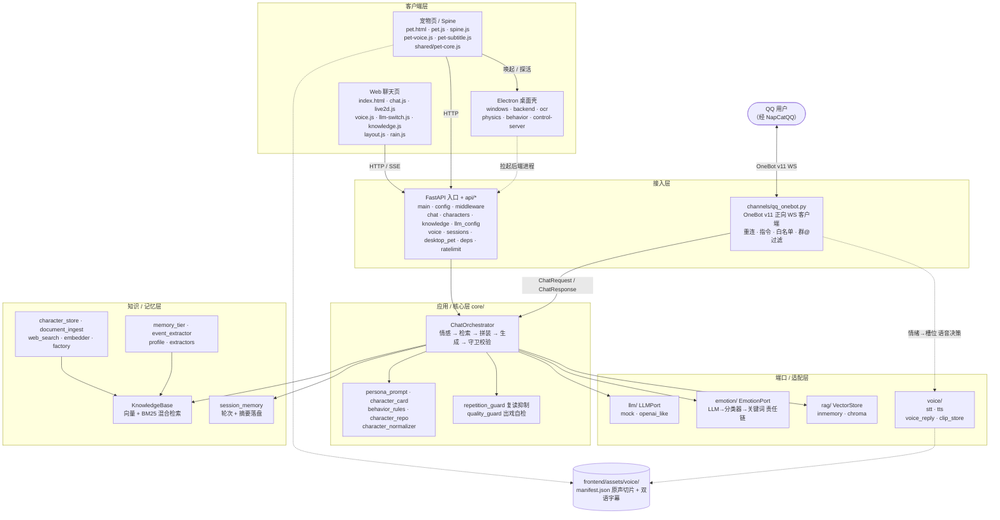

# 架构设计文档（RoleplayAI）

> 由软件架构师视角撰写，记录关键设计决策与依据。

## 1. 设计原则

| 原则 | 落地方式 |
|---|---|
| 单一职责 (SRP) | 每层只做一件事：路由只管 HTTP，编排只管流程，provider 只管外部调用 |
| 开闭原则 (OCP) | 新增 LLM/RAG 实现 = 新增一个适配器类，不改业务层 |
| 依赖倒置 (DIP) | 业务层依赖 `LLMPort` / `VectorStore` 抽象，不依赖具体 SDK |
| 接口隔离 (ISP) | 端口接口方法最小化，避免胖接口 |
| 分层 (Clean Arch) | API → Core(Orchestrator) → Ports/Adapters，依赖指向圆心 |
| 渠道隔离 | `channels/` 只做协议收发与会话态指令，零业务逻辑；大脑只有 `ChatOrchestrator` 一个，Web / QQ 共用 |

## 2. 总体架构图

> 实线 = 主调用链；虚线 = 数据 / 资源依赖。四个客户端入口（Web 聊天页、宠物页、Electron 桌面壳、QQ）最终都汇入同一个 `ChatOrchestrator`。



## 3. 代码架构表（v2.1，覆盖渠道 / 后端 / 前端 / 桌面端 / 脚本 / 数据 / 测试）

> 依赖方向遵守 Clean Architecture：外层依赖内层接口，业务层只依赖 `LLMPort` / `VectorStore` / `EmotionPort` 等抽象，不依赖具体 SDK；渠道层（QQ）与 API 层平行，同样只依赖 `ChatOrchestrator`。

| 层次 | 模块 | 路径 | 核心职责 | 关键类 / 接口 |
|---|---|---|---|---|
| 入口 | 应用装配 | `src/roleplay/main.py` | FastAPI 创建、lifespan 装配（含 QQ 渠道任务启停）、中间件注册、静态托管、健康检查 | `create_app` / `lifespan` |
| 入口 | 配置 | `src/roleplay/config.py` | pydantic-settings 配置，`ROLEPLAY_` 前缀，运行期不可变；含 `qq_*` 渠道与语音开关 | `Settings` / `get_settings` |
| 入口 | 中间件 / 安全 | `src/roleplay/middleware.py` | 安全响应头、请求日志 | `SecurityHeadersMiddleware` / `RequestLoggingMiddleware` |
| API 层 | 聊天 | `src/roleplay/api/chat.py` | 普通对话 + SSE 流式（`chunk` / `emotion` / `done`） | `chat` / `chat_stream` |
| API 层 | 角色管理 | `src/roleplay/api/characters.py` | 角色卡 CRUD、激活、删除 | `router` |
| API 层 | 知识库 | `src/roleplay/api/knowledge.py` | 文档 / URL / 上传 / 检索 / 统计 / 删除 | `router` |
| API 层 | LLM 配置 | `src/roleplay/api/llm_config.py` | 全局配置（脱敏）、Ollama 模型列表、连通性测试 | `router` |
| API 层 | 语音 | `src/roleplay/api/voice.py` | STT / TTS 上传与合成接口 | `router` |
| API 层 | 会话 | `src/roleplay/api/sessions.py` | 会话历史读取 | `router` |
| API 层 | 桌面宠物桥 | `src/roleplay/api/desktop_pet.py` | 桌面端拉起、探活、控制端口 | `router` |
| API 层 | 依赖注入 / 限流 | `src/roleplay/api/deps.py` / `ratelimit.py` | 装配 orchestrator / services / settings，IP 滑动窗口限流 | `get_orchestrator_dep` / `rate_limit` |
| 渠道层 | QQ 渠道 | `src/roleplay/channels/qq_onebot.py` | OneBot v11 正向 WS 客户端（对接 NapCat）：收事件 → 构造 `ChatRequest` → `ChatOrchestrator.run()` → 回发；断线重连、`!clear/!help/!char/!voice/!lang` 指令、私聊白名单、群内 @ 才回、命中语音条件改发原声切片（失败静默降级文字） | `QQChannel` / `start_qq_channel` |
| 应用层 | 对话编排 | `src/roleplay/core/orchestrator.py` | 一次对话用例：情感 → RAG → 角色卡 → LLM → 生成后守卫校验重试 → 记忆 / 摘要 | `ChatOrchestrator` |
| 领域 / 核心 | 角色卡 | `src/roleplay/models/character.py` + `core/character_card.py` | V2 角色卡模型、解析、system prompt、Lorebook 触发 | `CharacterCard` / `resolve_system_prompt` |
| 领域 / 核心 | 默认角色仓库 | `src/roleplay/core/character_repo.py` | 请求未携带角色卡时兜底加载内置角色卡（`assets/characters/`） | `CharacterRepo` |
| 领域 / 核心 | 文本标准化 | `src/roleplay/core/character_normalizer.py` | 空白 / 标点 / 列表 / 空值归一化 | `normalize_card_texts` |
| 领域 / 核心 | 结构化行为规则 | `src/roleplay/core/behavior_rules.py` | if-then 规则校验、匹配、按优先级渲染 | `match_condition` / `render_rules` |
| 领域 / 核心 | 提示词模板 | `src/roleplay/core/persona_prompt.py` + `models/prompt_config.py` | 字段开关 / 顺序 / 自定义模板、RAG / Profile 上下文拼装 | `build_roleplay_prompt` / `PromptConfig` |
| 领域 / 核心 | 复读抑制 | `src/roleplay/core/repetition_guard.py` | 最近角色发言提取禁用短语 → 注入 prompt 末尾 + 生成后逐字校验、命中重写（防整句照抄 few-shot 示例） | `build_repetition_block` / `find_violations` |
| 领域 / 核心 | 出戏自检 | `src/roleplay/core/quality_guard.py` | 纯规则三类检测：身份出戏 / 客服腔 / 替用户行动；命中追加重写指令（重试上限 2 次） | `find_quality_violations` |
| 端口 / 适配 | LLM | `src/roleplay/core/llm/` | `LLMPort` 抽象 + Mock / OpenAI 兼容实现（逐 token 真流式）、工厂 | `LLMPort` / `OpenAILikeProvider` / `MockLLMProvider` |
| 端口 / 适配 | 情感 | `src/roleplay/core/emotion/` | LLM → classifier → keyword 责任链，情绪 → Live2D 表情映射 | `EmotionPort` / `FallbackChainDetector` / `Live2DEmotionMapper` |
| 端口 / 适配 | RAG | `src/roleplay/core/rag/` | `VectorStore` 抽象 + 内存实现（零依赖）/ Chroma 实现 | `VectorStore` / `InMemoryVectorStore` / `ChromaVectorStore` |
| 端口 / 适配 | 语音 | `src/roleplay/core/voice/` | STT（faster-whisper）、TTS（edge-tts）、音频缓存；语音回复决策（用户情绪→槽位，阈值 / 冷却 / 语言）与原声切片库 | `transcribe_audio` / `synthesize_speech` / `VoiceReplyService` / `ClipStore` |
| 知识库 | 装配工厂 | `src/roleplay/core/knowledge/factory.py` | 一次性装配「知识库 + 角色仓库 + 联网检索 + 长期记忆」并把人设同步进 KB | `build_services` |
| 知识库 | 向量 / BM25 | `src/roleplay/core/knowledge/vector_store.py` | 命名空间向量库 + BM25 混合检索 / 重排 / 持久化 | `KnowledgeBase` |
| 知识库 | 嵌入器 | `src/roleplay/core/knowledge/embedder.py` | Hashing / Ollama 嵌入，连接池与自动重嵌入 | `EmbedderPort` / `OllamaEmbedder` |
| 知识库 | 长期记忆 | `src/roleplay/core/knowledge/memory_tier.py` | 每 N 轮合并 / 提取事件到向量库、衰减、剪枝 | `LongTermMemory` |
| 知识库 | 事件提取 | `src/roleplay/core/knowledge/event_extractor.py` | 事实 / 事件级结构化提取（LLM + Rule 兜底） | `LLMEventExtractor` / `RuleEventExtractor` |
| 知识库 | 用户画像 | `src/roleplay/core/knowledge/profile.py` + `profile_models.py` | 稳定属性 / 偏好 / 纪念日管理、同义合并 | `UserProfile` / `ProfileEntry` |
| 知识库 | 画像提取 | `src/roleplay/core/knowledge/extractors.py` | 用户画像 Rule + LLM 提取、三级 JSON 解析 | `RuleProfileExtractor` / `LLMProfileExtractor` |
| 知识库 | 角色存储 | `src/roleplay/core/knowledge/character_store.py` | 角色卡 CRUD、active 标记、persona 增量同步 KB | `CharacterStore` |
| 知识库 | 文档入库 | `src/roleplay/core/knowledge/document_ingest.py` + `ingest.py` | 文件 / URL / SQLite / 目录分块入库、标题感知分块 | `ingest_file` / `ingest_web` |
| 知识库 | 联网搜索 | `src/roleplay/core/knowledge/web_search.py` | DuckDuckGo / Bing / Tavily 适配 + 失败回退 | `WebSearchPort` / `FallbackWebSearch` |
| 知识库 | 安全工具 | `src/roleplay/core/knowledge/security_utils.py` | URL / IP / 本地路径白名单校验 | `safe_url` / `safe_local_path` |
| 会话 | 短期记忆 | `src/roleplay/core/session_memory.py` | 对话轮次 JSON 持久化 + 摘要落盘 / 复用 | `SessionMemory` |
| 错误 | 异常体系 | `src/roleplay/errors/` | 统一异常 + FastAPI 异常处理器（含校验错误脱敏） | `register_exception_handlers` |
| 模型 | DTO / 领域模型 | `src/roleplay/models/chat.py` + `models/character.py` + `models/prompt_config.py` | 请求 / 响应 / 角色卡 / 提示词配置纯数据模型 | `ChatRequest` / `ChatResponse` / `CharacterCard` |
| 前端 | 聊天页 | `frontend/index.html` + `frontend/js/chat.js` | 聊天 UI、SSE 渲染、情绪芯片、追问按钮、录音入口 | `window.RoleplayChat` |
| 前端 | 布局 / 装饰 | `frontend/js/layout.js` + `rain.js` | 分栏拖拽（写 `--stage-w`）/ HUD 折叠 / 窄屏侧边抽屉；「暴雨」纯装饰动效（尊重 reduced-motion） | — |
| 前端 | Live2D 表现 | `frontend/js/live2d.js` + `live2d-bootstrap.js` | 模型加载 / 表情 / 动作 / 交互 / 多模型切换 | `window.RoleplayLive2D` |
| 前端 | Spine 渲染 | `frontend/js/spine.js` | Spine 人偶渲染适配器（素材包自带 4.2 运行时）：相机 / 骨架变换、气泡区与落地线定位规则 | — |
| 前端 | 语音台词 | `frontend/js/pet-voice.js` + `pet-subtitle.js` + `frontend/assets/voice/` | 角色原声台词播放状态机（姿态 / 点击→槽位）、配音语言切换、脚下双语字幕 | `window.RoleplayPetVoice` |
| 前端 | 巡检工具 | `frontend/pet-inspect.html` + `pet-inspect.js` | Spine 动画巡检：实播全部动画、人工标注语义槽位、导出 `animation_map.json`（临时调试工具） | — |
| 前端 | 桌宠桥接 | `frontend/js/desktop-pet.js` | 网页 ↔ 桌面宠物双通道唤起：回环 HTTP（`/ping` `/launch`）优先、`roleplaypet://` 协议兜底 | — |
| 前端 | 共享核心 | `frontend/shared/pet-core.js` | Web 端与 Electron 壳共用的一份「动作库 + 意图事件」约定（纯数据，不触系统 API） | — |
| 前端 | 语音 | `frontend/js/voice.js` | 浏览器录音、Web Speech 降级、后端 `/voice` 调用 | `window.RoleplayVoice` |
| 前端 | 模型切换 | `frontend/js/llm-switch.js` | localStorage 配置、连通性测试、请求级覆盖 | `window.RoleplayLLM` |
| 前端 | 知识库面板 | `frontend/js/knowledge.js` | 文档列表 / 上传 / 检索 / 统计 UI | `knowledge.js` |
| 前端 | 桌面宠物页 | `frontend/pet.html` + `frontend/js/pet.js` | 宠物悬浮页：状态机 / Spine 渲染 / 气泡 / 设置抽屉 | `pet.js` |
| 桌面端 | Electron 主进程 | `desktop/src/main/*.js` | 窗口管理、后端拉起 / 探活、配置 patch 白名单、OCR（截图与文本仅内存流转，不落盘不上传）、拖拽动量 / 回弹物理、空闲自主漫步、回环控制服务（`ping` / `launch` / `talk`）、主进程帧循环垫片 | `index.js` / `windows.js` / `ocr.js` / `physics.js` / `behavior.js` / `control-server.js` |
| 数据 | 角色 / 知识 / 会话 / 语音 | `data/` + `src/data/` + `src/roleplay/assets/` + `frontend/assets/voice/` | 角色卡 JSON、知识库文件、会话记录、Live2D / Spine / 原声切片（manifest，中英双配音 + 双语字幕）资产 | — |
| 脚本 | 语音切片生产 | `scripts/voice_pipeline/` | 官方语音视频听录（faster-whisper）→ 文本校正 → 按时序切分中英双配音 → 生成 manifest | `transcribe_whole` / `cut_voice_clips` |
| 脚本 | 知识库入库 | `scripts/ingest_lore.py` · `bilibili_lore_ingest.py` · `build_spoken_lore.py` · `refresh_voice_lore.py` | 目录 / 文件 / URL / SQLite 入库；B 站视频文案逐视频串行一条龙（下载→转写→清洗→入库）；lore 第一人称口语化改写与幂等刷新 | — |
| 脚本 | 评测 / 验证 | `scripts/eval_rag_standard.py` · `eval_roleplay_quality.py` · `verify_*.py/js` · `migrate_rag_kb.py` · `switch_model.py` | RAG 标准评测、角色扮演质量评测、LLM / 语音链路 E2E 验证、向量库迁移与模型切换 | — |
| 测试 | 自动化测试 | `tests/` | 单元 / 集成 / QA 回归，镜像 `src/roleplay` | — |

## 4. 关键决策与依据

1. **配置用 `pydantic-settings` + `frozen=True` + `lru_cache`**
   - 依据：2026 主流实践。配置启动时解析一次、运行期不可变；`env_prefix` 解耦环境变量；测试用 `get_settings.cache_clear()` 重置。
2. **默认 `mock` provider**
   - 依据：让项目「开箱即跑、离线可测」，先有可替换端口再谈真实接入（依赖倒置的入口）。
3. **RAG 用接口 + 内存实现**
   - 依据：Chroma 等需要网络/安装；内存实现让单测不依赖外部服务，生产再切 `chroma`。
4. **情绪→表情用「名」不用「索引」**
   - 依据：上一轮核实发现两套 Live2D 模型表情数组顺序不同，写死索引换模型即错位；映射按表情名，运行时解析。
5. **emotion 枚举统一 7 类**
   - 依据：原两包前后端枚举错位（后端有 anxious、前端有 surprise/fear 但后端发不出），统一为 `happy/sad/angry/anxious/surprise/fear/neutral`。
6. **渠道层零业务逻辑**
   - 依据：渠道（QQ / 未来 Discord 等）演化速度远快于大脑，协议代码混入业务会演化出「第二大脑」。`qq_onebot` 只做 OneBot v11 收发、指令与白名单，人设 / RAG / 情感 / 记忆全部复用 `ChatOrchestrator`；新增渠道 = 新增一个 `channels/` 适配器。
7. **复读抑制走「提示词禁用块 + 生成后校验」，不依赖采样参数**
   - 依据：线上实测角色逐字复现 `mes_example` 示范句、同一意象连用三轮；token 级 `repetition_penalty` 只惩罚局部 token，挡不住整句照抄 few-shot。方案对齐社区做法（如 echoproof）：把最近角色发言渲染成禁用短语块注入 prompt 末尾，命中后带重写指令重试。
8. **出戏自检用纯规则而非 LLM 复审**
   - 依据：三类高频出戏（自称 AI、客服腔、替用户行动）规则可稳定覆盖，纯规则零延迟、零成本、可离线单测；LLM 复审留给未来有延迟预算时。
9. **QQ 语音回复 P0 用「情绪→原声切片」而非 TTS**
   - 依据：情绪信号取自对**用户消息**的检测（用户难过 → 角色发 sad 槽位原声），与前端宠物「姿态→槽位」行为三端一致（Web / 宠物 / QQ 共用同一套槽位语义与 manifest）；原声比 TTS 更贴人设。无切片命中或任何异常 → 静默降级纯文字，绝不因语音丢回复；TTS 作 P1 兜底预留（`qq_voice_tts_voice_en` 已预留配置）。

## 5. 数据流（单次对话）

```
POST /chat ｜ QQ 消息
  → ChatRequest 校验（api 层）或渠道层构造
  → Orchestrator.run(req)
      1. 解析角色卡（请求携带 → CharacterCard；否则 CharacterStore 激活角色 → CharacterRepo 内置兜底）
      2. 加载会话历史 + 摘要（SessionMemory）
      3. EmotionDetector.detect(user_text) → EmotionInfo（LLM→分类器→关键词责任链）
      4. KnowledgeBase（向量 + BM25）检索 → RAG 上下文 + UserProfile
      5. 拼装 system_prompt（人设 / 行为规则 / 模板 / 上下文 / 复读禁用块）
      6. LLMPort.generate(_stream) → reply（OpenAI 兼容 provider 逐 token 流式）
      7. 生成后校验：repetition_guard / quality_guard 命中 → 追加重写指令重试（上限 2 次）
      8. 持久化本轮 + 增量摘要 / 长期记忆合并 / 画像与事件提取
  → ChatResponse{reply, emotion, follow_ups}
  （SSE 变体另在 api 层包裹 event: chunk / emotion / done / tts）
```

QQ 渠道语音回复支线（`docs/QQ语音回复方案.md`）：

```
QQ 消息 → qq_onebot → ChatOrchestrator.run() → reply 文字
                └→ VoiceReplyService.decide(user_emotion)   # 开关 / 阈值 / 冷却 / 语言 / 群聊限制
                     → ClipStore.pick(槽位, lang)           # frontend/assets/voice manifest 选片
                     → 命中：base64 record 段发送；未命中 / 异常：静默降级纯文字
```

## 6. 已落地与扩展性路线

- **已落地**：`core/voice/`（STT / TTS / 语音回复决策 / 原声切片库）、QQ OneBot 渠道（文字 + 情绪触发语音回复）、`core/knowledge/`（文档入库 / 联网搜索 / 长期记忆 / 用户画像 / 装配工厂）、复读抑制与出戏自检双守卫、桌面宠物（Spine 渲染 / 原声台词 / 双语字幕 / 漫步 / 拖拽物理 / OCR / 回环控制服务）、OpenAI 兼容 provider 真流式、B 站文案与语音台词集入库管线。
- **后续候选**：语音回复 P1（TTS 兜底链路）、Lorebook 智能触发（LLM 双触发）、人格档案（`charprofile`）、会话摘要入向量库、多角色模型映射。
- **多角色**：Orchestrator 持有 `model_id`，前端 `Live2DEmotionMapper` 按模型取表情名。

## 7. 代码审查迭代记录（7 轮，基于 FastAPI 社区最佳实践）

审查维度：代码质量、安全性、性能、可维护性、边界与错误处理。

- **R1 功能性/性能/一致性**
  - 修复前端情绪芯片不显示且被流式文本覆盖（拆分文本 span 与芯片、pending 情绪补挂）。
  - `InMemoryVectorStore` 写入时预计算 TF 向量，避免每次查询重复分词。
  - `OpenAILikeProvider` 复用实例级 `httpx.AsyncClient`，新增 `max_tokens` 与 `aclose()` 生命周期管理。
  - 引入 `logging` 替换静默 `except`；默认系统提示词与角色卡字段标签中文化。
- **R2 安全/UX**
  - 新增 `SecurityHeadersMiddleware`（X-Content-Type-Options / X-Frame-Options / CSP 等）。
  - 新增内存滑动窗口限流依赖（按 IP，可配置，默认 60/min）。
  - 情绪分数封顶 1.0；前端渲染 `follow_ups` 追问按钮。
- **R3 架构/可测试性**
  - 编排器装配从「模块级 lru_cache 全局」改为「lifespan 构建 → `app.state.orchestrator` → `Depends` 注入」，依赖关系显式、生命周期透明。
- **R4 边界/健壮性**
  - `system_prompt`/`character_card` 加 `max_length` 上限（防 DoS）。
  - `message` 增加去空白校验，纯空白判为非法（422）。
  - 修复统一错误处理器对校验 `ctx` 中异常实例不可序列化（TypeError）的真实 bug。
- **R5 收尾**
  - 补充测试（内存检索相关性、限流触发、SSE 分数封顶、安全头、空白消息）。
  - 文档同步；全量测试通过。
- **R6 性能 / 一致性**
  - 修复 BM25 英文分词被拆成单字母的问题；BM25 建倒排索引。
  - Ollama 嵌入器复用连接池并分批请求；知识库记录嵌入器身份，切换嵌入器时自动重嵌入。
  - 人物增删改只增量同步 persona；联网抓取并发/批量入库并限制响应大小。
  - STT 模型加载移出事件循环；Whisper 推理走专属单线程 executor。
- **R7 配置 / 桌面端 / Chroma**
  - Settings 关键数值字段增加范围校验；`static_no_cache` 可配置。
  - Chroma 适配器补上 namespace 注入/过滤、基础混合重排与异步检索。
  - 桌面端配置 patch 白名单 + 类型清洗；IPC 消息校验发送者 frame。

> 已知限制（后续项）：mock provider 的 SSE 为「完整生成后切片」；OpenAI 兼容 provider 已实现逐 token 流式（`generate_stream`），其余 provider 可继续实现 `LLMPort.generate_stream`。
