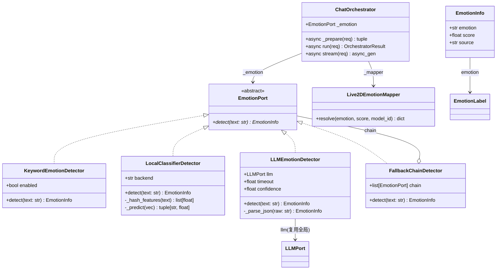
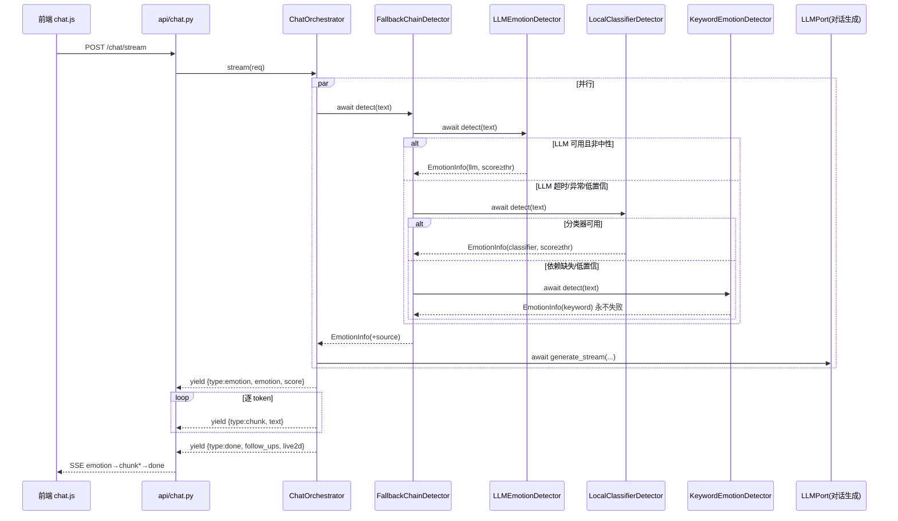
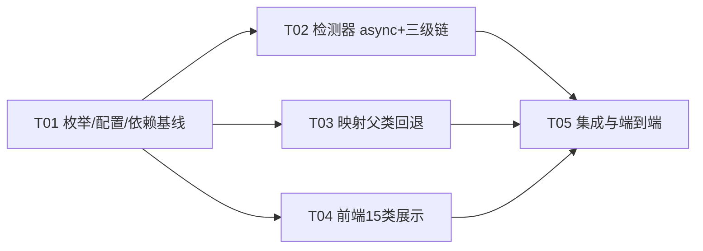

# 情绪检测升级（7→15 类 + LLM/分类器辅助）增量架构设计

> 作者：软件架构师 高见远（Gao）｜版本：v1.0｜范围：增量，基于已核实技术现状
> 上游：产品经理许清楚的增量 PRD；下游：工程师实现、QA 验证

---

## 0. 方案总览

在既有「Clean Architecture + EmotionPort 策略模式」上做**接口异步化 + 三级检测链 + 15 类全链路穿透**：

1. **接口演进**：`EmotionPort.detect` 由同步改为 `async`（决策 1，唯一一次破坏性改动，波及面已核实仅 3 个调用点）。
2. **三级降级链**：新增 `LLMEmotionDetector`、`LocalClassifierDetector`，与现有 `KeywordEmotionDetector` 组合为「LLM → 分类器 → 关键词」责任链（决策 4），每级失败静默降级并记录 `source`。
3. **15 类枚举**：`EmotionLabel` 扩展为 15 类 + 父类表；`Live2DEmotionMapper.resolve()` 增加父类链回退（决策 7）。
4. **本地分类器**：P1 落地「零依赖词哈希特征 + 逻辑回归分类头」，jina-embeddings 作为可选的 P1.5 增强（决策 3），依赖缺失自动禁用。
5. **隐私/性能**：默认 `auto` 且 LLM 不可用时绝不外发；检测与回复生成**并行**（`asyncio.gather`），emotion 事件仍先于 chunk，契约不变。

**不改动**：SSE 契约（`emotion → chunk* → done`，emotion 事件体 `{emotion, score}`）、`ChatRequest/Response`、`LLMPort`、`OpenAILikeProvider`、路由层。

---

## 1. 架构决策记录（ADR）

### ADR-1：EmotionPort 接口演进 → **① 改为 async**

- **结论**：`EmotionPort.detect` 改为 `async def detect(self, text: str) -> EmotionInfo`；orchestrator `_prepare` 中 `await self._emotion.detect(...)`；Keyword/Local/LLM 三个实现全部 async；`build_emotion_detector` 签名保持 `(*, enabled: bool = True, settings: Settings | None = None)`（向后兼容既有调用 `build_emotion_detector(enabled=...)`）。
- **理由**：
  - LLM/嵌入检测天然是 IO 异步；同步接口桥接 async 有两个坑：FastAPI 事件循环内 `asyncio.run()` 抛「loop already running」，线程池桥接则每请求多一次线程切换且无法取消。
  - 加第二个 `AsyncEmotionPort` 会破坏「单一端口」的简洁性，且 orchestrator 已有 1 处同步调用点，改 async 只是加一个 `await`。
  - 调用方波及面已核实：仅 `orchestrator.py:149`、`tests/conftest.py`、`tests/test_emotion.py`、`tests/test_orchestrator.py`（同步测试改为 async + `await`，pytest-asyncio auto 模式无需额外配置）。
- **兼容策略**：`detect` 为纯 async；CPU 密集的本地分类推理内部用 `asyncio.to_thread`，不阻塞事件循环。

### ADR-2：LLM 辅助检测提示词策略 → **JSON 输出 + 归一化 + 复用全局 LLMPort**

- **结论**：
  - 提示词要求输出**单行 JSON**：`{"emotion": "<15类之一>", "score": 0.0-1.0, "reason": "<一句话，可选>"}`；不要求纯标签（JSON 可同时携带 reason，为 P2-3 可解释性预留，本期不展示不存储）。
  - 解析策略：`json.loads` 失败 → 正则抽取 `"emotion"\s*:\s*"([^"]+)"` → 再失败按 neutral 兜底（记为 `parse_fail`）。
  - 温度固定 `0.0`（确定性优先），`max_tokens=64`（仅覆盖 JSON 长度）。
  - **复用全局 `LLMPort`**（`build_llm(settings)` 的单例实例，含连接池/重试/脱敏），不新建 HTTP 客户端；**不引入独立小模型配置**（本地单用户场景，复用即零额外配置；若未来要换小模型，仅改 factory 一处）。
- **理由**：JSON 契约解析鲁棒且自带 reason 扩展位；复用 LLMPort 符合依赖倒置且避免自建客户端的密钥/重试/脱敏三重复制。

### ADR-3：轻量分类器实现路径 → **两段式：零依赖哈希分类器（P1 落地）+ jina 嵌入（P1.5 可选增强）**

- **结论**：
  - **P1（必做，零外部依赖）**：`LocalClassifierDetector` 用「字符/词哈希特征（复用 `HashingEmbedder` 思路，`hashlib.md5` + 768 维）+ 逻辑回归分类头」。分类头权重为**内置常量表**（15 类×768 维稀疏系数 + bias，随代码分发，约 KB 级），加载为 numpy 风格纯 Python 计算（仅用 `math`/`struct` 或可选 numpy）。
  - **P1.5（可选增强，本次不做实现，仅留接口位）**：`sentence-transformers` + `jina-embeddings-v3`（或更小的 `jina-embeddings-v2-base-zh`）本地 CPU 推理。**延迟加载**（首次 detect 时 `asyncio.to_thread` 加载，启动不阻塞）；`import` 失败或权重缺失 → 该层自动禁用并降级到关键词层，**绝不抛异常**。
  - 推理统一 `asyncio.to_thread` 跑同步推理。
- **理由**：jina 依赖（`sentence-transformers`≈数百 MB + 权重下载）不符合「本地优先 + 开箱即跑」；哈希+线性分类头零依赖、P95 稳定 <10ms，先把 15 类链路跑通，后续无损升级嵌入特征。

### ADR-4：三级降级链 → **Chain of Responsibility（责任链）+ 显式层级标记**

- **结论**：新增 `FallbackChainDetector(EmotionPort)`，构造时注入有序列表 `[LLM, LocalClassifier, Keyword]`（按 `emotion_detector` 配置裁剪，见 ADR-5）。
  - 每级：`try: r = await det.detect(text); if r.emotion != "neutral" or r.score > 0: return r`，**任何异常只 `logger.warning` 并继续下一级**；关键词层永不失败（不抛异常）。
  - 返回的 `EmotionInfo` 增加 `source: Literal["llm","classifier","keyword","none"] = "none"` 字段（P2 可解释性预留，SSE 事件体仍只发 `{emotion, score}`，不新增协议字段；`source` 仅进日志）。
  - 语义：**上层只在中性/低置信时下沉**——LLM 说 neutral 不算失败，但会继续让分类器/关键词尝试（对显式情绪文本更敏感）；LLM 明确给出非 neutral 且 score≥`emotion_llm_confidence` 则直接采用。
- **理由**：组合优于继承；每级失败不中断符合「情感检测绝不拖垮主回复」的 P0 原则。

### ADR-5：配置设计（frozen Settings 兼容）

新增字段（全部带默认值，旧 .env 无需改动）：

```python
# ---- 情感检测升级 ----
emotion_detector: Literal["keyword", "classifier", "llm", "auto"] = "auto"
# auto = LLM 可用(非mock且api_key非空)时 LLM→classifier→keyword；LLM 不可用且分类器可用时 classifier→keyword；否则 keyword
emotion_llm_timeout: float = 8.0        # LLM 检测调用超时（秒），独立于对话生成超时
emotion_confidence_threshold: float = 0.4  # LLM/分类器结果置信度下限；低于则下沉下一级
emotion_classifier_backend: Literal["hashing", "jina"] = "hashing"  # P1.5 时切 jina
emotion_jina_model: str = "jina-embeddings-v2-base-zh"
```

- `frozen=True` 兼容：字段在类定义时声明即可，运行期不写回（`build_emotion_detector` 读取即用）。
- 决策 5 待确认项「云端配置入口」：**本期不做 UI 入口**，仅 .env/环境变量配置；前端 HUD 灵敏度（`emotion_threshold`）已能覆盖运行期阈值调节（决策 5b）。

### ADR-6：全链路 15 类穿透（精确改动清单）

**枚举**（`models/chat.py`）：

```python
EmotionLabel = Literal[
    "happy","sad","angry","anxious","surprise","fear","neutral",
    "love","grateful","excited","disappointed","lonely","embarrassed","confused","sleepy",
]
# 父类表（新增 8 类的三级兜底映射）
EMOTION_PARENT: dict[str, str] = {
    "love":"happy","grateful":"happy","excited":"happy",
    "disappointed":"sad","lonely":"sad",
    "embarrassed":"anxious","confused":"anxious","sleepy":"neutral",
}
```

**逐文件改动**：
| 文件 | 改动 |
|---|---|
| `src/roleplay/models/chat.py` | EmotionLabel 扩为 15 类；新增 `EMOTION_PARENT` 常量；`EmotionInfo` 增加 `source: Literal["llm","classifier","keyword","none"] = "none"` |
| `src/roleplay/core/emotion/detector.py` | 接口 async；`KeywordEmotionDetector.detect` async；`EMOTION_PATTERNS` 扩 8 类关键词（love/grateful/excited/disappointed/lonely/embarrassed/confused/sleepy）；新增 `LLMEmotionDetector`、`LocalClassifierDetector`、`FallbackChainDetector`、`normalize_emotion_label()`；`build_emotion_detector` 按配置组装 |
| `src/roleplay/core/emotion/mapping.py` | `resolve()` 增加父类链回退：`emotions[emotion] → emotions[EMOTION_PARENT[emotion]] → default`；`_DEFAULT_MAP` 增 8 类（expression 沿用父类、motion 细分） |
| `src/roleplay/core/emotion/__init__.py` | 导出新增类 |
| `src/roleplay/core/orchestrator.py` | `_prepare` 步骤 2 加 `await`；**并行化**：`emotion_task = asyncio.create_task(...)` 与知识检索并行，`_prepare` 内 `await asyncio.gather`（emotion 先于 chunk 的时序由 stream() 首事件保证，不受影响） |
| `src/roleplay/api/deps.py` | `build_emotion_detector(enabled=s.enable_emotion, settings=s)` 传入 settings |
| `frontend/assets/live2d/emotion_map.json` | 新增 8 类映射（expression 沿用父类 expression、motion 用细分动作组） |
| `frontend/js/chat.js` | `EMOTION_CN` 增 8 类中文名；`appendEmotionChip` 保持 `EMOTION_CN[emotion] || emotion` 兜底（已兼容） |
| `frontend/js/live2d.js` | `onEmotionEvent` 增加**前端父类回退**：`map.emotions[emotion] → map.emotions[parent] → map.default`（后端已回退时前端幂等，双保险） |
| `tests/test_emotion.py` | async 化 + 新增 15 类/降级链/父类回退用例 |
| `tests/test_orchestrator.py` | async 化 |
| `tests/conftest.py` | detector fixture async；env 补 `ROLEPLAY_EMOTION_DETECTOR=keyword`（测试默认最快路径） |
| `pyproject.toml` | 可选依赖组 `emotion = ["numpy>=1.26"]`（P1.5 时追加 sentence-transformers） |

**SSE 契约不变**：`emotion` 事件体仍 `{emotion, score}`（`source` 不进协议）。

### ADR-7：父类回退链 + 未知标签归一化

- `normalize_emotion_label(raw: str) -> EmotionLabel`：小写化 → strip → 去除空格/下划线/连字符 → 映射别名表（`joy→happy`、`angry→angry`、`terrified→fear`、`tired→sleepy` 等）→ 合法集合校验 → 非法回 `neutral`。
- `Live2DEmotionMapper.resolve()` 回退顺序：`emotions[emotion]` → `emotions[EMOTION_PARENT[emotion]]` → `default`。父类本身（happy/sad/...）无父类，直接走 default。
- 前端 `live2d.js` 同构实现（后端已归一化时永不触发，双保险）。

---

## 2. 类图



---

## 3. 时序图（单次对话流，含三级降级）



（注：`_prepare` 内 emotion 与知识检索并行 await；emotion 事件仍先发，因 stream() 在 LLM 生成前首推 emotion。）

---

## 4. 文件级改动清单（增量）

**后端（新增 1 文件、修改 7 文件）**
| 文件 | 操作 | 要点 |
|---|---|---|
| `src/roleplay/core/emotion/classifier.py` | **新增** | `LocalClassifierDetector` + 哈希特征 + 内置逻辑回归权重常量 |
| `src/roleplay/models/chat.py` | 修改 | 15 类枚举 + `EMOTION_PARENT` + `EmotionInfo.source` |
| `src/roleplay/core/emotion/detector.py` | 修改 | async 接口；关键词 15 类；`LLMEmotionDetector`；`FallbackChainDetector`；`normalize_emotion_label`；工厂组装 |
| `src/roleplay/core/emotion/mapping.py` | 修改 | 父类链回退 + `_DEFAULT_MAP` 8 类 |
| `src/roleplay/core/emotion/__init__.py` | 修改 | 导出 |
| `src/roleplay/core/orchestrator.py` | 修改 | `_prepare` await + 并行 gather |
| `src/roleplay/api/deps.py` | 修改 | 传 settings |
| `src/roleplay/config.py` | 修改 | 新增 5 个配置字段 |

**前端（2 文件）**
| 文件 | 操作 | 要点 |
|---|---|---|
| `frontend/assets/live2d/emotion_map.json` | 修改 | 8 类新映射 |
| `frontend/js/chat.js` | 修改 | `EMOTION_CN` 8 类 |
| `frontend/js/live2d.js` | 修改 | `onEmotionEvent` 前端父类回退 |

**测试/依赖（4 文件）**
| 文件 | 操作 | 要点 |
|---|---|---|
| `tests/test_emotion.py` | 修改 | async + 新增用例 |
| `tests/test_orchestrator.py` | 修改 | async |
| `tests/conftest.py` | 修改 | fixture async + env |
| `pyproject.toml` | 修改 | `emotion` 可选依赖组 |

---

## 5. 配置变更

见 ADR-5。新增 5 个字段均带默认值，旧 .env 零改动；`ROLEPLAY_EMOTION_DETECTOR=keyword` 为测试固定值（conftest 设置）。

## 6. 依赖变更

- **运行时新增（P1 必装）**：无强制新增（哈希分类器仅用 stdlib `hashlib`/`math`）。建议 optional 组：`numpy>=1.26`（加速分类头矩阵乘，缺失时回退纯 Python 实现）。
- **可选（P1.5，本期不实现）**：`sentence-transformers>=2.7`（含 torch），权重 `jina-embeddings-v2-base-zh` 手动下载至 `./data/models/`。
- **pyproject 新增**：
  ```
  emotion = ["numpy>=1.26"]
  ```

## 7. 共享约定（跨文件）

- 15 类枚举常量：后端 `models/chat.py` 为唯一事实源；前端 `EMOTION_CN` 与 `emotion_map.json` 手工镜像（已注释）。
- 父类表 `EMOTION_PARENT`：后端 `models/chat.py`；前端 `live2d.js` 内联镜像。
- `source` 字段仅日志/内部使用，**不进入 SSE emotion 事件体**（协议稳定）。
- 降级原则：检测器任何异常/超时只 `logger.warning`，绝不向上抛；关键词层永不失败。
- 隐私：`auto` 模式仅在 `llm_provider != "mock"` 且 `llm_api_key` 非空时启用 LLM 级，否则零外发（本地优先默认）。
- 性能预算：LLM 检测超时 8s（对话生成 30s 独立）；分类器 P95 ≤10ms；关键词 P95 ≤5ms；emotion 与 chunk 解耦（emotion 在首 chunk 前必达）。

## 8. 待明确事项

无（5 个待确认项已由 ADR-1/3/5/6/7 决策闭环）。

---

## 9. 任务分解（≤5 个任务，按依赖排序）

### T01 项目基础设施与枚举/配置基线（P0）
- **文件**：`src/roleplay/models/chat.py`、`src/roleplay/config.py`、`pyproject.toml`
- **依赖**：无
- **内容**：15 类枚举 + `EMOTION_PARENT`；`EmotionInfo.source`；config 5 个新字段；optional 依赖组。
- **验收**：`pytest tests/test_emotion.py::test_neutral_default` 仍绿；`get_settings()` 可读新字段；`EmotionLabel` 含 15 类；导入无环。

### T02 检测器层：async 接口 + 关键词 15 类 + LLM 检测器 + 责任链（P0）
- **文件**：`src/roleplay/core/emotion/detector.py`、`src/roleplay/core/emotion/classifier.py`、`src/roleplay/core/emotion/__init__.py`、`src/roleplay/core/orchestrator.py`、`src/roleplay/api/deps.py`、`tests/test_emotion.py`、`tests/test_orchestrator.py`、`tests/conftest.py`
- **依赖**：T01
- **内容**：接口 async；关键词 15 类词表；`LLMEmotionDetector`（JSON 解析+归一化+复用 LLMPort）；`LocalClassifierDetector`（哈希+线性头，依赖缺失自动禁用）；`FallbackChainDetector`；`normalize_emotion_label`；orchestrator await + 并行 gather；deps 传 settings；测试 async 化 + 新增降级链/归一化用例。
- **验收**：全量测试绿（140→~160）；`test_run_detects_emotion` 通过；LLM mock 路径返回 `source="llm"`；关键词永不抛异常。

### T03 映射层：父类回退 + 后端 Live2D 映射 15 类（P0）
- **文件**：`src/roleplay/core/emotion/mapping.py`、`frontend/assets/live2d/emotion_map.json`、`frontend/js/live2d.js`
- **依赖**：T01
- **内容**：`resolve()` 父类链回退；`_DEFAULT_MAP` 8 类；json 文件 8 类；前端 `onEmotionEvent` 同构回退。
- **验收**：`resolve("love", score=0.8)` 落到 happy 的 expression；`resolve("confused", 0.9)` 落到 anxious；无映射 emotion 落 default；前端新增类可驱动表情。

### T04 前端展示：EMOTION_CN 15 类 + 视觉分组（P0/P1）
- **文件**：`frontend/js/chat.js`、`frontend/index.html`（`.emotion-chip` 分组色 class）
- **依赖**：T01
- **内容**：`EMOTION_CN` 增 8 类中文；chip 按父类分组着色（happy 系/ sad 系/ anxious 系/ neutral 系），新增 4 个 CSS class；`appendEmotionChip` 保持兜底。
- **验收**：手动发「我好爱你」显示「喜欢/爱」chip 且有分组色；未知 emotion 显示原文（兜底不崩）。

### T05 集成与端到端验证（P0）
- **文件**：`src/roleplay/core/emotion/__init__.py`（导出核对）、`tests/test_api.py`（SSE 契约回归）、`docs/emotion_upgrade_design.md`（如有偏差同步）
- **依赖**：T02、T03、T04
- **内容**：SSE `emotion→chunk*→done` 契约回归（15 类任意 emotion 事件体仍 `{emotion, score}`）；LLM 不可用 4 场景降级冒烟（mock 无 key / 超时 / 非法 JSON / 分类器缺依赖）；启动时 `ROLEPLAY_EMOTION_DETECTOR=auto` 全链路手测。
- **验收**：`test_chat_stream_emits_events` 等 API 测试绿；手动 `curl /chat/stream` 15 类消息均出 emotion 事件；性能 P95 关键词 ≤300ms（本地观测）；无外发（mock 下抓包无外部请求）。

**任务依赖图**



> 说明：T02/T03/T04 相互独立、仅依赖 T01，可并行；T05 收口。任务数 5，符合硬上限；每任务 ≥3 文件（T01 为 3 文件）。
