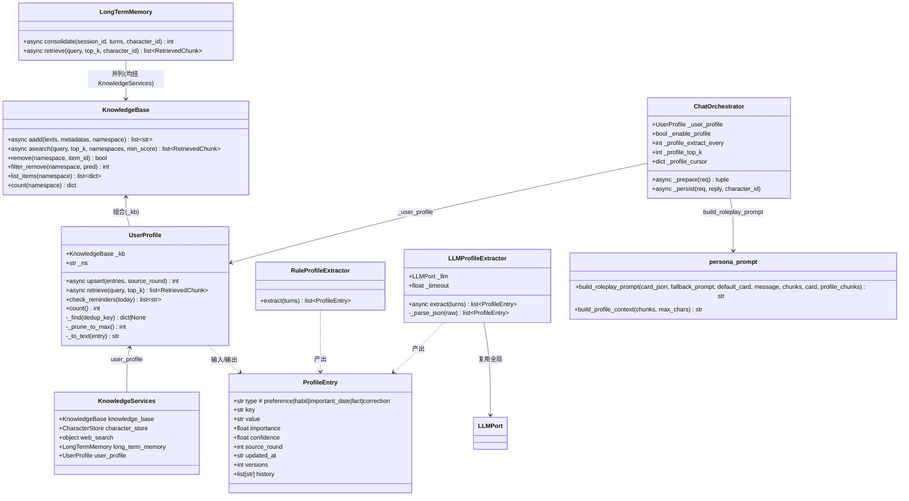
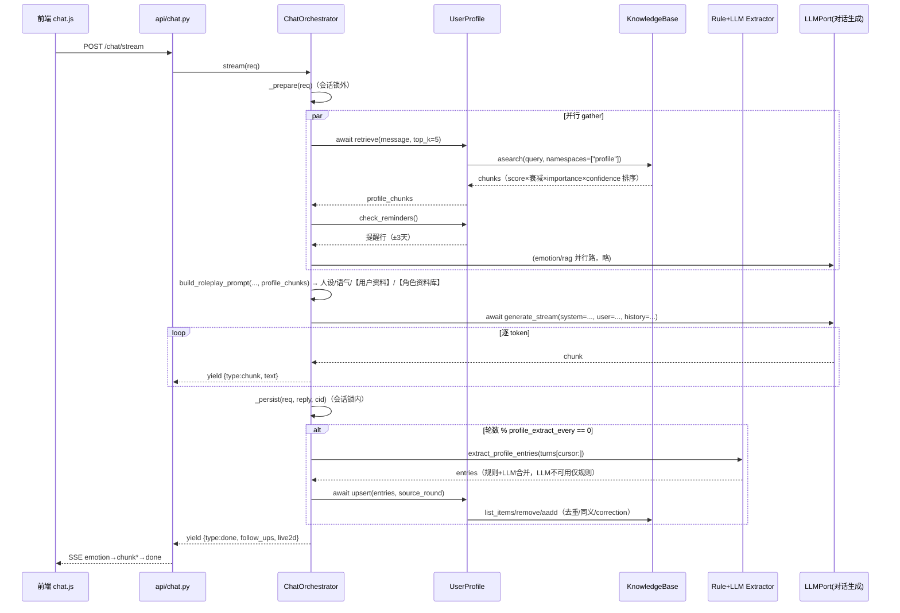
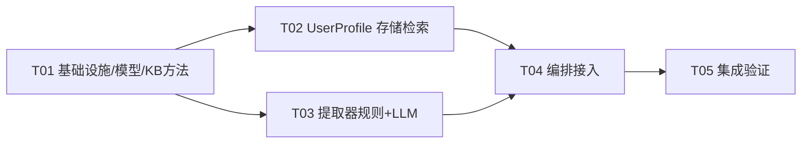

# 用户画像（UserProfile）增量架构设计

> 作者：软件架构师 高见远（Gao）｜版本：v1.0｜范围：增量，基于主理人核实的技术现状
> 上游：产品经理许清楚的增量 PRD（画像 4 类型 + 去重键 + P0/P1）；下游：工程师实现、QA 验证

---

## 0. 方案总览

在既有「Clean Architecture + KnowledgeBase 多命名空间向量库 + LongTermMemory 分层记忆」上做**独立 UserProfile 层**：

1. **独立模块**：新增 `UserProfile`（`core/knowledge/profile.py`），不扩展 LongTermMemory——稳定属性（偏好/习惯/日期/事实）与事件叙事职责分离（决策 1）。
2. **存储落地**：每条画像 = vector store 一条记录，`text` 为可读画像句、`metadata` 承载 `{type,key,value,importance,confidence,source_round,updated_at,versions}`；复用 `aadd`/`asearch`（已核实 metadata 为任意 JSON 字典、`RetrievedChunk.metadata` 可取到）。**新增 `KnowledgeBase.list_items(namespace)`** 用于按 key 查重（决策 2）。
3. **提取**：`RuleProfileExtractor`（正则模板、低置信 0.3，永不失败）+ `LLMProfileExtractor`（复用全局 LLMPort、JSON 数组输出、三级解析兜底），组合策略「规则兜底 + LLM 优先合并」，输入复用 `_persist` 中 consolidate 的游标切片（决策 3）。
4. **去重/更新/冲突**：去重键 `{type}:{norm_key}`（key 小写去空白）；精确命中 → value 更新 + versions+1；未命中 → 向量相似度 >0.85 判同义更新；否定 → correction 覆盖 + importance 降半（决策 4）。
5. **注入**：每轮 `_prepare` 并行检索 profile（top-K=5，importance×置信×时间衰减排序），经 `build_profile_context` 生成「【用户资料】」块，插在「人设→语气」之后、「【角色资料库】」之前（决策 5）。
6. **P1 提醒**：`UserProfile.check_reminders()` 扫描 important_date，±3 天内生成提醒行随 profile 块注入（决策 6）。
7. **隐私**：LLM 提取仅在 `llm_provider != "mock"` 且 `llm_api_key` 非空时启用，mock 模式零外发（决策 3/7 复用 emotion 的 `_llm_layer_available` 语义）。
8. **装配**：`KnowledgeServices` 增加 `user_profile`，`build_services`/`deps.py`/orchestrator 构造器全链路注入（决策 8）。

**不改动**：`LLMPort`、`OpenAILikeProvider`、SSE 契约、`LongTermMemory` 行为、路由层、`CharacterCard` 结构。

---

## 1. 架构决策记录（ADR）

### ADR-1：UserProfile 模块形态 → **独立类，不扩展 LongTermMemory**

- **结论**：新增独立类 `UserProfile`（`core/knowledge/profile.py`），组合 KnowledgeBase（持 `_kb` 引用），写入独立命名空间 `profile`（预留 `profile:<user_id>` 多用户扩展）。`KnowledgeServices` 增加 `user_profile: UserProfile` 字段装配。
- **理由**：LongTermMemory 语义是「事件叙事」（合并轮次→事件文本，`_ns_for` 按角色隔离，importance 规则来自文本关键词）；画像语义是「用户稳定属性」（结构化 `{type,key,value}`、按 key 去重、correction 覆盖）。两者去重机制、更新方式、隔离粒度（角色 vs 用户）均不同，硬塞进一个类会让 `_ns_for`/`consolidate`/`retrieve` 全是 if-else 分支。独立类职责单一、可独立测试。
- **关系**：UserProfile **组合** KnowledgeBase（依赖倒置，只依赖 `KnowledgeBase` 具体类与其 `_data` 语义，不依赖 RAG 抽象——因为需要 `list_items`/`filter_remove` 等 KB 特有能力）；与 LongTermMemory **并列**，都挂在 `KnowledgeServices` 上。

### ADR-2：存储形态落地 → **一条画像 = 一条 vector store 记录，metadata 全量承载 + 新增 list_items**

- **结论**：
  - `text` = `f"（{类型中文}）{key}：{value}"`（含类型前缀便于检索与人工排查）；
  - `metadata` = `{type, key, value, importance, confidence, source_round, updated_at, versions}`（`updated_at` ISO8601 UTC；KB 自动补 `ts`/`id`/`namespace`）。
  - **已核实**：`aadd(texts, metadatas, namespace)` 的 `metadatas` 为 `list[dict]`，`_collect` 内 `meta = dict(item.get("meta", {}))` 原样透传进 `RetrievedChunk.metadata`，无字段白名单；落盘 `json.dumps(ensure_ascii=False)` 要求 JSON 可序列化（本设计字段全部满足）。
  - **新增 KB 方法**：`def list_items(self, namespace: str) -> list[dict]`——锁内返回 `self._data.get(namespace, [])` 的浅拷贝（item dict 复制，vec 引用即可），供 UserProfile 按 key 扫描查重。**不改 `filter_remove`**：更新 = `kb.remove(ns, old_id)` + `aadd` 新记录（remove 已存在，幂等安全）。
- **理由**：无按 metadata 查询方法（已核实 `_collect` 只按向量检索），profile 条目数受 `profile_max_items=200` 硬上限约束，全量扫描 O(200) 每 10 轮一次，成本可忽略；不新增复杂索引。

### ADR-3：提取逻辑 → **规则兜底 + LLM 优先合并，输入复用 consolidate 的 turns 切片**

- **结论**：
  - `RuleProfileExtractor.extract(turns) -> list[ProfileEntry]`（同步、永不失败、confidence=0.3）：正则模板「我喜欢/我讨厌/我习惯/我每（天|周）/我的生日/我住在/我养了/我今年/我从事…」映射 `type`（喜欢→preference、习惯→habit、生日/纪念日/每年…日→important_date、其余→fact）；**否定检测**：`(其实|现在|不再|改成|别|不要|不)…(喜欢|需要|想要|讨厌)` 命中 → 产出 `type="correction"`。
  - `LLMProfileExtractor.extract(turns)`（复用 `LLMPort`，参考 `LLMEmotionDetector`：`asyncio.wait_for(timeout)` + 异常只 `logger.warning` + 三级解析）：提示词要求输出单行 JSON 数组 `[{"type":"preference|habit|important_date|fact|correction","key":"...","value":"...","importance":0.0-1.0}]`，温度 0.0；解析 `json.loads` → 正则抽 `[{...}]` → `[]` 兜底。
  - **组合** `extract_profile_entries(turns, rule, llm, llm_available)`：`llm_available` 判定复用 emotion 语义（`provider != "mock" and api_key`）；LLM 可用 → `rule.entries + llm.entries` 按去重键合并（LLM 优先保留，规则补漏）；LLM 不可用/超时/解析失败 → 仅规则条目。
  - **输入复用**：orchestrator `_persist` 中与 consolidate 共用同一 `turns = history[cursor:]` 切片（新游标 `_profile_cursor` 独立推进），避免重复拼接。
- **理由**：规则层保证离线/降级可用（P0-4 隐私：mock 零外发）；LLM 层提升 recall 与类型准确度；复用全局 LLMPort 避免自建客户端（与 emotion 先例一致）。

### ADR-4：去重/更新/冲突消解 → **精确键 + 相似度同义 + correction 覆盖的具体算法**

`UserProfile.upsert(entries, source_round)` 对每条 entry：
1. `norm_key = re.sub(r"\s+", "", key).lower()`；`dedup_key = f"{type}:{norm_key}"`。
2. **精确命中**：`_find(dedup_key)` 扫描 `list_items(ns)`（匹配 `meta["type"]` + 归一化 `meta["key"]`）→ 命中则更新：`value=新值`、`versions+1`、`updated_at=now`、`confidence=max(old,new)`、`importance=max(old,new)`、`source_round`；旧 value 追加进 `versions_history`（metadata 增 `history: list[str]`，上限 10）。
3. **未命中 → 同义检查**（仅当 entry.confidence ≥ 0.4，规则条目跳过省成本）：`asearch(f"{key} {value}", top_k=3, namespaces=[ns], min_score=0)`；若 top 命中 `metadata["type"] == entry.type` 且 `score ≥ profile_synonym_threshold(0.85)` → 视为同义：更新该条 `value`、`versions+1`（保留原 canonical key）。
4. **correction**（type="correction"）：按 `key` 精确/同义找原条目 → 更新 `value=新值`、`importance=max(0.3, old*0.5)`（降权）、`versions+1`、`metadata["corrected"]=True`；找不到原条目 → 转存为 `fact` 条目 importance=0.3。
5. 新增条目前执行 `_prune_to_max()`：`count > profile_max_items` 时按 `importance` 升序淘汰最低者（保留 important_date）。

### ADR-5：注入 → **persona_prompt 纯函数扩展 profile_chunks，orchestrator 并行检索**

- **结论**：
  - `persona_prompt.build_roleplay_prompt(..., profile_chunks: list[RetrievedChunk] | None = None)`；新增 `build_profile_context(chunks, max_chars=1200)` 生成「【用户资料】」块（头：`以下是你对这位用户的了解，自然运用，不要提及系统机制`）；块位置：人设 → 语气 → **【用户资料】** → 【角色资料库】。
  - 检索放 orchestrator `_prepare`：新增第三路 `_profile_task` 与 emotion/retrieve 并行 `asyncio.gather`，返回 `profile_chunks`（独立于 RAG chunks，不混排）。
  - 排序：`eff = score × exp(-λ·age_days) × (0.5+0.5·importance) × (0.5+0.5·confidence)`（复用 `memory_decay_lambda`），top-K=`profile_top_k=5`；注入时复用 `MIN_CONTEXT_SCORE=0.05` 过滤。
- **理由**：persona_prompt 保持纯函数（可单测）；profile 与事件记忆语义不同，独立块避免「角色资料库」来源标注混乱；并行检索不增加首 token 延迟。

### ADR-6：P1 主动提醒 → **UserProfile.check_reminders() 同步扫描 + 合成 chunk 注入**

- **结论**：`check_reminders(user_id=None, today=None) -> list[str]`：扫描 `list_items(ns)` 中 `type=="important_date"` 条目，`value` 正则解析 `YYYY-MM-DD` 或 `M月D日`（年周期）；与 `today` 差值 `|days| ≤ profile_reminder_days(3)` → 生成 `「今天/后天是用户的{key}（{date}）」`；不可解析跳过。orchestrator `_prepare` 调用后，把提醒行包装为 `RetrievedChunk(text=..., score=1.0, metadata={"namespace":"profile","type":"reminder"})` 并入 `profile_chunks`（置顶），由 LLM 自然带出。
- **理由**：提醒是「读取型」轻操作，放 `_prepare`（锁外、只读、不落盘）零风险；不新增调度器（每轮天然检查）。

### ADR-7：配置设计（frozen Settings 兼容）

新增字段（全部带默认值，旧 .env 零改动）：

```python
# ---- 用户画像（UserProfile） ----
profile_enabled: bool = True            # 总开关
profile_extract_every: int = 10         # 每 N 轮提取一次画像（独立于 longterm_consolidate_every）
profile_top_k: int = 5                  # 每轮注入画像条数上限
profile_max_items: int = 200            # 画像条目硬上限（超出淘汰低 importance）
profile_llm_timeout: float = 8.0        # LLM 提取超时（秒），独立于对话生成
profile_synonym_threshold: float = 0.85 # 同义判定相似度阈值
profile_reminder_days: int = 3          # important_date 提醒窗口（±天）
profile_namespace: str = "profile"      # 画像命名空间（预留 profile:<uid>）
```

### ADR-8：装配与调度 → **全链路注入 + _persist 独立计数**

- `factory.KnowledgeServices` 增加 `user_profile: UserProfile`；`build_services` 构建 `UserProfile(kb, settings=s)`（namespace=`s.profile_namespace`）。
- `deps.build_orchestrator` 传 `user_profile=services.user_profile`、`enable_profile=s.profile_enabled`、`profile_extract_every/ profile_top_k`。
- `ChatOrchestrator.__init__` 增参：`user_profile: UserProfile | None = None`、`enable_profile: bool = True`、`profile_extract_every: int = 10`、`profile_top_k: int = 5`；内部构建 `self._rule_extractor` + `self._profile_llm = build_profile_extractors(get_settings(), self._llm)`。
- `_persist`（会话锁内）新增调度块：复用 `_turn_counts[sid]` 计数，当 `% profile_extract_every == 0` 且 `enable_profile and user_profile` → 取 `history[_profile_cursor[sid]:]` → `extract_profile_entries(...)` → `await upsert(entries, source_round=len(history))` → 推进 `_profile_cursor`；**try/except logger.warning 不影响主流程**（P0-5）。
- `clear_session` 增加 `self._profile_cursor.pop(session_id, None)`。

### ADR-9：待确认 5 项决策（产品经理留白，由架构决策闭环）

| 待确认项 | 决策 |
|---|---|
| 跨角色共享 | 画像为**用户级**（全局 `profile` 命名空间），默认跨角色共享；`profile:<uid>` 为多用户扩展位，P2 再配置策略 |
| 默认提取节奏 | `profile_extract_every=10`（独立于 consolidate 的 6，画像更新频率低于事件沉淀） |
| 管理 UI | 本期不做（P2）；调试用 `/api/knowledge/stats` 已能看 profile 命名空间条目数 |
| 提醒粒度 | 仅注入提示词由 LLM 自然带出（P1-1），不新增独立通知通道 |
| 低置信处理 | 规则条目 confidence=0.3 照常入库但跳过同义检查；correction 降 importance 至 ≥0.3；`profile_max_items` 淘汰低 importance |

---

## 2. 类图



## 3. 时序图（单次对话流，含画像提取与注入）



---

## 4. 文件级改动清单（增量）

**后端（新增 4 文件、修改 8 文件）**
| 文件 | 操作 | 要点 |
|---|---|---|
| `src/roleplay/core/knowledge/profile_models.py` | **新增** | `ProfileEntry`（pydantic）+ 类型枚举/中文标签 + 归一化 key 函数 |
| `src/roleplay/core/knowledge/profile.py` | **新增** | `UserProfile`：upsert 去重/同义/correction/检索排序/提醒/上限淘汰 |
| `src/roleplay/core/knowledge/extractors.py` | **新增** | `RuleProfileExtractor` + `LLMProfileExtractor` + `extract_profile_entries` 组合 |
| `src/roleplay/core/knowledge/vector_store.py` | 修改 | 新增 `list_items(namespace)`（锁内浅拷贝） |
| `src/roleplay/core/knowledge/factory.py` | 修改 | `KnowledgeServices.user_profile`；`build_services` 装配 |
| `src/roleplay/core/knowledge/__init__.py` | 修改 | 导出 UserProfile/ProfileEntry/extractors |
| `src/roleplay/core/orchestrator.py` | 修改 | 构造器 4 新参；`_prepare` 第三路并行 profile 检索 + 提醒；`_persist` 提取调度；`clear_session` 清游标 |
| `src/roleplay/core/persona_prompt.py` | 修改 | `build_profile_context` + `build_roleplay_prompt(profile_chunks=)`；`_source_label` 增 profile→用户资料 |
| `src/roleplay/api/deps.py` | 修改 | `build_orchestrator` 传 user_profile 与 profile 配置 |
| `src/roleplay/config.py` | 修改 | 新增 8 个 profile_* 字段 |
| `tests/test_knowledge.py` | 修改 | `list_items` 用例 |
| `tests/conftest.py` | 修改 | 固定 `ROLEPLAY_PROFILE_*` 测试配置 |

**测试（新增 2 文件）**
| 文件 | 操作 | 要点 |
|---|---|---|
| `tests/test_profile.py` | **新增** | upsert 去重/同义/correction/检索排序/提醒/上限淘汰/持久化 |
| `tests/test_extractors.py` | **新增** | 规则类型/否定→correction/LLM 三级解析/组合降级 |

**文档（新增/修改 3 文件）**
| 文件 | 操作 | 要点 |
|---|---|---|
| `docs/user_profile_design.md` | **新增** | 本设计 |
| `docs/profile-class-diagram.mermaid` / `docs/profile-sequence-diagram.mermaid` | **新增** | 独立 mermaid（不覆盖 emotion 的现有文件） |

## 5. 配置变更

见 ADR-7：新增 8 个 `profile_*` 字段，全部带默认值；conftest 固定 `ROLEPLAY_PROFILE_ENABLED=true`、`ROLEPLAY_PROFILE_EXTRACT_EVERY=2`（测试提速）、`ROLEPLAY_PROFILE_TOP_K=3`。

## 6. 依赖变更

无新增运行时依赖（规则/JSON/正则均 stdlib；复用现有 LLMPort 与 EmbedderPort）。

## 7. 共享约定（跨文件）

- 画像条目字段：`{type,key,value,importance,confidence,source_round,updated_at,versions}`（`history` 可选）；`updated_at` 为 ISO8601 UTC；KB 自动补 `ts`。
- 去重键 `{type}:{norm_key}`；`norm_key = re.sub(r"\s+","",key).lower()`。
- 命名空间：`profile`（用户级全局，预留 `profile:<uid>`）。
- 隐私：LLM 提取仅在 `llm_provider != "mock"` 且 `llm_api_key` 非空；mock 模式仅规则提取零外发。
- 降级：提取/检索/提醒任何异常只 `logger.warning`，绝不向上抛、不影响主回复。
- 注入块顺序：人设 → 语气 → 【用户资料】→ 【角色资料库】；profile 注入复用 `MIN_CONTEXT_SCORE=0.05`。
- 时间衰减：复用 `memory_decay_lambda` 语义（`exp(-λ·age_days)`）。

## 8. 待明确事项

无（PRD 5 个待确认项已由 ADR-9 决策闭环）。

---

## 9. 任务分解（≤5 任务，按依赖排序）

### T01 基础设施：配置字段 + 画像数据模型 + KB 查询方法（P0）
- **文件**：`src/roleplay/config.py`、`src/roleplay/core/knowledge/profile_models.py`（新增）、`src/roleplay/core/knowledge/vector_store.py`、`tests/test_knowledge.py`
- **依赖**：无
- **内容**：8 个 `profile_*` 配置字段；`ProfileEntry` pydantic + 类型枚举/中文标签/`normalize_key`；`KnowledgeBase.list_items(namespace)` 锁内浅拷贝；`list_items` 单测。
- **验收**：`get_settings()` 可读新字段；`ProfileEntry` 校验非法 type 报错；`list_items` 返回拷贝且不含内部引用；全量测试仍绿。

### T02 画像核心：UserProfile 存储/去重/检索/提醒 + 装配（P0）
- **文件**：`src/roleplay/core/knowledge/profile.py`（新增）、`src/roleplay/core/knowledge/factory.py`、`src/roleplay/core/knowledge/__init__.py`、`tests/test_profile.py`（新增）
- **依赖**：T01
- **内容**：`UserProfile`（upsert 精确键/同义 0.85/correction 降权/上限淘汰/`retrieve` importance×衰减排序/`check_reminders` ±3 天/`_to_text`）；`KnowledgeServices.user_profile` + `build_services` 装配；导出；核心单测（含持久化重启不丢）。
- **验收**：同 key 二次 upsert `versions==2`；相似文本同义更新不新增；correction 后 `importance` 降半且 `corrected=True`；retrieve 高 importance 排前；reminder 命中 ±3 天；重启后条目仍在。

### T03 提取器：规则 + LLM + 组合降级（P0/P1）
- **文件**：`src/roleplay/core/knowledge/extractors.py`（新增）、`tests/test_extractors.py`（新增）、`tests/conftest.py`
- **依赖**：T01
- **内容**：`RuleProfileExtractor`（类型映射 + 否定→correction，confidence=0.3）；`LLMProfileExtractor`（复用 LLMPort、JSON 数组、三级解析兜底、超时/异常降级）；`extract_profile_entries` 组合（LLM 可用→规则+LLM 合并去重；否则仅规则）；conftest 固定 profile 测试环境变量。
- **验收**：规则对「我喜欢咖啡/我习惯早起/我生日是5月20日/我养了猫」类型正确；「其实我不喜欢咖啡」产出 correction；LLM mock/超时/非法 JSON 三场景均不抛异常且回退规则；`llm_available=False` 时零 LLM 调用。

### T04 编排接入：orchestrator 注入 + persona_prompt 资料块 + deps（P0/P1）
- **文件**：`src/roleplay/core/orchestrator.py`、`src/roleplay/core/persona_prompt.py`、`src/roleplay/api/deps.py`、`tests/test_orchestrator.py`、`tests/test_api.py`
- **依赖**：T02、T03
- **内容**：orchestrator 构造器 4 新参；`_prepare` 第三路并行 profile 检索 + 提醒合成；`_persist` 提取调度（`_profile_cursor` 独立推进、异常不影响主流程）；`clear_session` 清游标；`build_profile_context` + `build_roleplay_prompt(profile_chunks=)`；`_source_label` 增 profile；deps 全链路装配；编排层测试（profile_chunks 注入、每 N 轮提取入库、clear 清理）。
- **验收**：每轮 system prompt 含「【用户资料】」块且 ≤top_k 条；聊满 extract_every 轮后 profile 命名空间有新增条目；mock 模式抓包零外发；LLM 提取失败不影响本轮回复；`clear_session` 后游标重置不再重复提取。

### T05 集成验证与文档同步（P0）
- **文件**：`tests/test_profile.py`（端到端补充）、`tests/test_api.py`（SSE 契约回归）、`docs/user_profile_design.md`、`docs/profile-class-diagram.mermaid`、`docs/profile-sequence-diagram.mermaid`
- **依赖**：T04
- **内容**：端到端冒烟（TestClient 聊 N 轮 → profile 命名空间落盘 → 重启检索命中）；SSE `emotion→chunk*→done` 契约回归（profile 注入不改事件体）；mermaid 图与设计文档同步。
- **验收**：全量测试绿（257 + 新增）；`curl /chat/stream` 聊 10 轮后 `GET /api/knowledge/stats` 可见 `profile` 条目；重启服务后注入仍命中；文档行数 ≤350。

**任务依赖图**


