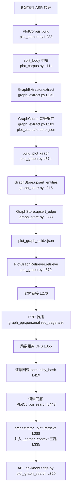

# 剧情时间轴与 GraphRAG 联动设计

> **生成时间**：2026-09-10  
> **配套**：`剧情术语对照词表.md`、`剧情文件清洗清单.md`、`剧情清洗注意事项.md`、`剧情时间轴与人物去向图.md`  
> **目标**：把「术语表 / 时间轴 / 人物去向图」三份新产物接入现有 GraphRAG，且**不破坏现有功能**。


---

## 一、现有链路全景



| 环节     | 文件                                           | 入口                                                               | 现状                                                         |
| ------ | -------------------------------------------- | ---------------------------------------------------------------- | ---------------------------------------------------------- |
| 语料加载   | `src/roleplay/core/knowledge/plot_corpus.py` | `PlotCorpus.build` (L238)                                        | 三重白名单过滤；`parse_title_meta` (L87) 已解析 `version/arc/pubdate` |
| 切块     | 同上                                           | `split_body` (L111)                                              | 2 477 chunks                                               |
| LLM 抽取 | `plot_graph.py`                              | `build_plot_graph` (L574) → `_call_extract` (L669)               | prompt 见 `EXTRACT_PROMPT_ZH` (L67) / `_EN` (L80)           |
| 缓存     | `graph_extract.py`                           | `GraphCache` (L183)                                              | 按 chunk sha1 幂等                                            |
| 建图     | `graph_store.py`                             | `upsert_entities` / `upsert_edge` (L338) / `save` (L133)         | `entity_id`=sha1 (L37)，`norm_name`=NFKC+小写 (L32)           |
| 别名归并   | `build_plot_graph.py`                        | `load_alias_table` (L161) → `GraphStore.bind_alias_table` (L265) | **优先级最高**，是术语表的天然挂接点                                       |
| 关系归一   | `relation_vocab.py`                          | `CANONICAL_RELATIONS` (L46)、`canonicalize_relation` (L477)       | 77 个规范谓语，未映射即丢弃                                            |
| 噪声过滤   | `plot_graph.py`                              | `is_noise_entity` (L143)                                         | 建图时过滤                                                      |
| 检索     | `plot_graph.py`                              | `PlotGraphRetriever.retrieve` (L370)                             | 链接 → PPR → 跳数 → 证据 → 词法兜底                                  |
| 编排     | `orchestrator.py`                            | `_plot_retrieve` (L288)                                          | 并入五路上下文                                                    |

**关键空白**：`version/arc/pubdate` 已解析进 `PlotChunk`，但**图谱节点与边没有剧情时间字段**；  
`GraphStore.edges_of` (L416) 只按插入时间戳 `ts` 排序，**不是剧情时间**。这正是时间轴要补的位置。

---

## 二、四个挂接点总览

| #      | 新产物    | 挂接位置                                                                                           | 改动类型                            | 是否破坏现有   | 优先级   |
| ------ | ------ | ---------------------------------------------------------------------------------------------- | ------------------------------- | -------- | ----- |
| **G1** | 术语对照词表 | `load_alias_table` (build_plot_graph.py L161) + `is_noise_entity` (plot_graph.py L143)         | **纯数据**（合并 `plot_aliases.json`） | 否        | 🔴 最高 |
| **G2** | 剧情时间轴  | `build_plot_graph` 调 `upsert_edge` (L649) 时写入 `story_time`；`PlotGraphRetriever.retrieve` 加时间过滤 | 数据 + 少量代码                       | 否（新字段可选） | 🟡 中  |
| **G3** | 人物去向图  | 新增 `plot_whereabouts.json`；检索时对「角色 + 时间」类查询做时空约束                                               | 新文件 + 检索增强                      | 否        | 🟡 中  |
| **G4** | 来源分级   | `plot_corpus._parse_transcript_file` (L415) 写 `source_kind`；检索层过滤                              | 数据 + 少量代码                       | 否        | 🔴 高  |

---

## 三、G1 · 术语对照词表 → 节点归一（最高优先级）

### 3.1 现状问题

| 现象      | 数据                                                      |
| ------- | ------------------------------------------------------- |
| 实体名去重数  | 6 473                                                   |
| 现有别名表覆盖 | 340 个表层形式（**仅 12.3% 的提及**）                              |
| 最严重分裂   | 圣洛夫基金会 4 个节点（173 次提及）、暴雨 4 个节点（137 次）、重塑之手 16 个变体（82 次） |

### 3.2 挂接方式

1. **`plot_glossary.json → alias_flat`** 提供了 54 组 / 149 个表层形式，**按 key 取并集合并**进 `data/lore/<cid>/plot_aliases.json`
2. `load_alias_table` (build_plot_graph.py L161) 加载后交给 `GraphStore.bind_alias_table` (L265)，**优先级高于 LLM 抽取结果**
3. 零 LLM 重放重建：`--build-graph`，日志应显示 `extracted: 0 / cached: 2477`

```bash
# 1. 备份（强制）
cp data/lore/wu_ming_zhe/plot_aliases.json \
   data/lore/wu_ming_zhe/plot_aliases.json.bak_$(date +%Y%m%d_%H%M%S)

# 2. 合并（脚本待开发；当前可人工或临时脚本按 key 取并集）
# 3. 重放重建
.venv/Scripts/python.exe -X utf8 scripts/build_plot_graph.py \
    --character wu_ming_zhe --build-graph

# 4. 验收
.venv/Scripts/python.exe -X utf8 scripts/audit_full_corpus.py
.venv/Scripts/python.exe -X utf8 scripts/acceptance_plot_graph.py
pytest -k "plot or graph"
```

### 3.3 预期效果

| 指标         |    当前 |      归并后（预期） |
| ---------- | ----: | -----------: |
| 「圣洛夫基金会」度数 |   200 | 显著上升（4 节点合一） |
| 「暴雨」度数     |    91 | 显著上升（4 节点合一） |
| 别名索引条目     | 9 096 |      增加约 150 |
| 实体总数       | 5 095 |   下降（分裂节点合并） |

### 3.4 噪声侧

`plot_glossary.json → noise` 三类清单接入 `is_noise_entity` (plot_graph.py L143)：

- `confirmed`（30 项）：直接过滤
- `generic_zh`（14 项）+ `pronoun_en`（9 项）：直接过滤
- `pending_review`（39 项）：**保留不动**，等 NPC 译名确认（S1）后再决定归并还是删除

---

## 四、G2 · 剧情时间轴 → 边的时间维度

### 4.1 数据结构改动（向后兼容）

```jsonc
// plot_graph_<cid>.json 的 edge 增加可选字段
{
  "src": "伊戈尔",
  "dst": "重塑之手",
  "relation": "隶属于",
  "confidence": 0.7,
  "importance": 0.5,
  "evidence": ["<chunk_hash>"],
  "ts": 1788000000.0,          // 现有：插入时间戳（保留）
  "source": "doc_id",           // 现有
  // ↓↓↓ 新增（全部可选，缺省时行为与现在一致） ↓↓↓
  "story_time": { "era": "忧郁的热带", "precision": "unknown" },
  "narrative_order": null,
  "event_ref": null,            // → plot_timeline.json 的 event_id
  "version": null,
  "arc": null,
  "source_kind": "canon"
}
```

**兼容性保证**：所有新字段可选；现有读取 `edges` 的代码不受影响。

### 4.2 写入时机

在 `build_plot_graph` 调 `upsert_edge`（plot_graph.py L649）时，从当前 `PlotChunk` 取 `version` / `arc` / `pubdate` 一并写入；  
`story_time` 通过 `event_ref` 关联时间轴，不在图谱内复制时间数据（遵循注意事项 E2：单一事实源）。

### 4.3 检索增强

`PlotGraphRetriever.retrieve`（plot_graph.py L370）增加可选的时间感知：

| 查询类型         | 行为                      |
| ------------ | ----------------------- |
| 一般查询         | **不变**（默认关闭时间过滤，保证无回归）  |
| 「XX 之前 / 之后」 | 按 `narrative_order` 过滤边 |
| 「那时候 XX 在哪」  | 走 G3 去向图                |
| 「第 N 次暴雨时」   | 按 `story_time.era` 过滤   |

**落地顺序**：先只加字段不启用过滤 → 跑通验收 → 再在检索层加可选开关（默认 `off`）。

---

## 五、G3 · 人物去向图 → 时空约束

### 5.1 关联方式

```
plot_whereabouts.json  ──canonical_id──▶  图谱实体（角色节点）
        │                                       ▲
        └──event_ref──▶ plot_timeline.json      │
                                                 │
plot_corpus chunk ◀──evidence_hash───────────────┘
```

- `plot_whereabouts.json.tracks[].canonical_id` = 图谱实体的规范名
- `plot_whereabouts.json.tracks[].points[].event_ref` = `plot_timeline.json` 的 `event_id`（或 `Nxx` 个人事件号）
- `plot_timeline.json.events[].evidence_hash` = `plot_corpus` 的 chunk hash（可回查原文）

### 5.2 解决的检索问题

| 用户提问          | 当前图谱的短板                                 | 去向图如何解决                            |
| ------------- | --------------------------------------- | ---------------------------------- |
| 「我现在在哪」       | 图谱只有「无名者—遇见→司辰」，无时间维度                   | 取 `tracks[无名者]` 最后一条 → 司辰小队        |
| 「伊戈尔到底是哪边的」   | 图谱同时存在「伊戈尔—隶属于→圣洛夫基金会」与「—隶属于→重塑之手」，看似矛盾 | 去向图给出**时间序列**，说明是「芝诺→重塑→脱离→基金会」的演变 |
| 「1990 年我在做什么」 | 无法按时间检索                                 | 按 `story_time` 定位 N07 蓝手帕旅馆        |
| 「那时候维尔汀在哪」    | 无时间信息                                   | 去向矩阵按时间点查                          |

### 5.3 消歧规则（关键）

当图谱中出现**同一角色对不同阵营的「隶属于」边**时：

1. 优先查 `plot_whereabouts.json` 的 `points[].faction`
2. 若该边带 `story_time`，按时间取对应 `point`
3. 都缺失 → **并列展示演变过程**，不得随机选一条（这正是「伊戈尔阵营」曾经看似矛盾的根因）

---

## 六、G4 · 来源分级 → 证据权重

| `source_kind` | 来源                              | 检索权重    | 说明      |
| ------------- | ------------------------------- | ------- | ------- |
| `canon`       | 缺德的德鲁伊主线 ASR（257 页）+ 官方 PV（2 个） | 1.0     | 默认只取这一类 |
| `analysis`    | 其余 7 个 UP 主考据解读视频（63 chunks）    | 0.3（降权） | 仅作补充证据  |

写入位置：`plot_corpus._parse_transcript_file`（L415）解析时按 `uploader` / `title` 判定，写进 `PlotChunk`。  
检索层：`PlotGraphRetriever` 的证据回查（L419）按 `source_kind` 加权。

> **风险提醒**：`analysis` 类视频含 UP 主主观推断，其表述会被抽取器当作剧情事实写入图谱，  
> 污染「暴雨是什么」「谁免疫」一类核心问答。**必须在语料层打标，而非图谱层事后清理。**

---

## 七、实施步骤（分阶段，每步可回退）

| 阶段     | 内容                                                           | 改动类型         | 验收              | 回退方式                        |
| ------ | ------------------------------------------------------------ | ------------ | --------------- | --------------------------- |
| **S0** | 备份 `plot_aliases.json` / `plot_cache/` / `plot_graph_*.json` | 无            | 备份文件存在          | —                           |
| **S1** | 合并术语表（G1）                                                    | 纯数据          | 节点分裂收敛；三项验收全绿   | 还原 `plot_aliases.json`，重放重建 |
| **S2** | `source_kind` 打标（G4）                                         | 数据 + 语料层少量代码 | 9 个非主线文档标记正确    | 字段可置空，行为不变                  |
| **S3** | 类型白名单 + 关系归一（清单 C3/C4）                                       | 代码           | `pytest` 无回归    | git revert                  |
| **S4** | 边加 `story_time` 等**可选字段**（G2 前半）                             | 代码           | 字段写入正确，检索行为不变   | 字段可忽略                       |
| **S5** | 时间轴与去向图 JSON 落地（G3 数据层）                                      | 新文件          | schema 校验通过     | 删文件                         |
| **S6** | 检索层时间感知（默认 `off`）                                            | 代码           | 开关 `off` 时与现状一致 | 开关关闭                        |
| **S7** | 噪声清理（`pending_review` 待 S1 确认）                               | 数据           | 审计零新增缺陷         | 还原缓存                        |

**每步之后必跑**：

```bash
.venv/Scripts/python.exe -X utf8 scripts/audit_full_corpus.py
.venv/Scripts/python.exe -X utf8 scripts/acceptance_plot_graph.py
pytest -k "plot or graph"
```

**基线**：`pytest` 529 passed、`plot or graph` 18 passed、数据层验收 R1–R14 全绿。

---

## 八、无回归红线

| 红线                  | 说明                                         |
| ------------------- | ------------------------------------------ |
| 不改 `entity_id` 生成方式 | sha1 确定性（graph_store.py L37）；改动会导致全图 ID 失效 |
| 新增字段一律可选            | 缺省时行为与现在完全一致                               |
| 别名合并只取并集            | 禁止覆盖 `plot_aliases.json` 已有条目              |
| 检索改动必须有开关           | 且默认关闭                                      |
| 不重新抽取               | 仅改别名/元数据时用 `--build-graph` 零 LLM 重放        |
| 不动 `.env`、不启服务      | 全部为离线数据操作                                  |

---

## 九、风险与已识别坑位

| 风险            | 说明                                                           | 应对                                           |
| ------------- | ------------------------------------------------------------ | -------------------------------------------- |
| **过度归并**      | 编辑距离 ≤2 的自动聚类会把 `Adele`/`apple`、`Martin`/`Vertin` 混在一起       | 术语表已人工圈定边界；`pending_review` 项不自动归并           |
| **Ars longa** | `Arcanum`(10) 曾被误并为 `Arcana`（阿尔卡纳）                           | 术语表已拆分为「神秘术」与「阿尔卡纳」两条，按上下文判定                 |
| **考据混入**      | `analysis` 类来源占比虽小（63/2477）但集中在核心设定问答                        | G4 语料层打标 + 检索降权                              |
| **时间字段猜填**    | 13 个版本中 12 个剧情内年代未确认                                         | 一律写 `null` + `status: pending`，禁止用版本号充当      |
| **大文件**       | `lore_wu_ming_zhe.json` 58 MB、`graph_wu_ming_zhe.json` 41 MB | 分块读写；清洗前确认磁盘空间                               |
| **备份堆积**      | 已有 4 组 `plot_cache_bak_*`                                    | 确认无回滚需求后归档到 `data/knowledge/_archive/`，勿直接删除 |

---

## 十、文件清单（本轮新增）

| 文件                                         | 类型     | 说明                                            |
| ------------------------------------------ | ------ | --------------------------------------------- |
| `docs/剧情术语对照词表.md`                         | 文档     | 原文 ↔ 规范译名映射（A–F 六节）                           |
| `data/lore/wu_ming_zhe/plot_glossary.json` | **数据** | 机器可读术语表，54 词条 / 149 表层形式 / 含 `alias_flat` 兼容段 |
| `docs/剧情文件清洗清单.md`                         | 文档     | 表一：20 项清洗条目 + 执行顺序 + 待补充汇总                    |
| `docs/剧情清洗注意事项.md`                         | 文档     | 表二：格式/命名/一致性等 8 类约束 + 禁止事项                    |
| `docs/剧情时间轴与人物去向图.md`                      | 文档     | 三层时间模型 + 暴雨轴 + 事件表 + 去向图 + 扩展接口               |
| `docs/剧情时间轴与GraphRAG联动.md`                 | 文档     | 本文件                                           |

> **未修改任何现有文件**——所有产物均为新增，符合「不破坏现有挂接」原则。
