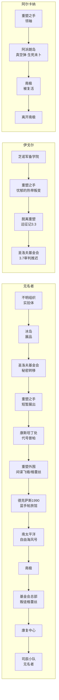

# 剧情时间轴与人物去向图

> **生成时间**：2026-09-10　**事实基准**：灰机 wiki（https://res1999.huijiwiki.com/）+ 本地语料
> **配套**：`剧情术语对照词表.md`、`剧情文件清洗清单.md`、`剧情清洗注意事项.md`、`剧情时间轴与GraphRAG联动.md`
> **重要**：本文件区分「**现实发布序**」与「**剧情实际发生时间**」，二者**不可混用**。

---

## 一、三层时间模型

| 层 | 名称 | 定义 | 当前状态 | 用途 |
|---|---|---|---|---|
| **L1** | 现实发布轴 | 游戏版本更新 / 视频发布日期（`pubdate`、`version`） | ✅ 完整可用 | 语料组织、增量采集 |
| **L2** | 暴雨回溯轴 | 每一次「暴雨」造成的世界时间跳转（wiki 权威列表） | ✅ 10 场已核实 | 理解世界观的时间结构 |
| **L3** | 剧情内事件轴 | 事件在故事世界中的**实际发生时间**（`story_time`） | ⚠️ 部分确认，大量**待补充** | 时间轴检索、人物去向、防剧透 |

> **关键约束**：版本号（如 3.7）是**现实更新序**，不是剧情内时间。
> 例：3.7「他者的悲哀」发布于 2026-04-30，但剧情内时间待确认；无名者实装于 2026-05-21（3.7 版本期内）。

---

## 二、L2 · 暴雨时间轴（灰机 wiki 权威，10 场）

> 来源：[/wiki/暴雨](https://res1999.huijiwiki.com/wiki/暴雨)「暴雨列表」——按时间顺序列出目前已发生过的暴雨。
> 注意「现实年份」是玩家侧年代，「暴雨前/后时间」是世界被回溯到的年代。

| # | 现实年份 | 暴雨前时间 | 暴雨后时间 | 备注 | 对应章节 |
|---|---|---|---|---|---|
| 01 | 1999 | **1999-12-31** | 1996 年某日清晨 | **第一场「暴雨」** | 序幕 |
| 02 | 2000 | 1996 年 | 1985 年某日晚 | 第五章 IDM 显示 | 5SP-01 |
| 03 | 2003 | **1987-09-27 晚** | 1977 年 | 发生于**维尔汀幼年「越狱行动」** | 第三章 / 5SP-05 |
| 04 | 2004 | 1978 年 | 1935 年 | 第五章 IDM 显示 | — |
| 05 | 2006 | 1936 年 | 1912 年 | 第五章 IDM 显示 | — |
| 06 | 2007 | 1913 年 | 1966 年 4 月前 | 第五章 IDM 显示 | — |
| 07 | 2007 | **1966-06-03** | **1929-02-14** | 发生于**序幕** | — |
| 08 | 2007 | 1929-02-15 | 1913 年 8 月（推测） | 发生于 | 2ND-15 |
| 09 | 2007 | 1914-01-13 | 1990-08-15 | 发生于 | 7TH-27 |
| 10 | 2008 | 1991-03-31 | 1920 年 | 发生于 | 10TH-25 |

**关键推论**：世界时间**不是单调前进**的——第 06 场从 1913 跳到 1966（向前），第 07 场又从 1966 退回 1929（向后）。
因此人物去向图**不能**用简单递增时间轴，必须允许「回溯」造成的位置重置。

---

## 三、L3 · 剧情内事件时间表（按剧情实际发生时间排序）

> **状态图例**：✅ wiki 已核实　⚠️ 部分确认（依据二手考据或单源）　❓ **待补充**（时间未确认）

| 序 | 剧情内时间 | 事件 | 主要参与者 | 来源 | 状态 |
|---|---|---|---|---|---|
| E01 | **1999-12-31** | **第一次暴雨**。重塑之手举行穿越时空仪式试图回到「空白时代」；圣洛夫基金会联合芝诺军备学院，兀尔德行动因白方阻止致仪式未完成，灭世大洪水化为「暴雨」 | 重塑之手、圣洛夫基金会、芝诺、阿尔卡纳 | wiki 暴雨页 + 本地脉络文档 | ✅ |
| E02 | 1999-12 | 一封信由伦敦卡纳比街寄给维尔汀，信封写「Open It Together」 | 维尔汀 | 本地脉络文档 | ⚠️ |
| E03 | 维尔汀幼年（第一防线学校时期） | 维尔汀出生满月即入校；因公开追问「暴雨」被关禁闭，结识圈环；组织学生出逃 | 维尔汀、圈环、伊莎贝拉、康斯坦丁 | 本地脉络文档 | ⚠️ |
| E04 | **1987-09-27**（暴雨 03） | **维尔汀 12 岁「越狱行动」**：出逃当天暴雨发生，圈环、伊莎贝拉等化作几何体消失，维尔汀独存 | 维尔汀、圈环、伊莎贝拉 | wiki 暴雨列表 | ✅ |
| E05 | 1987 | 「1987 宇宙组曲」篇章（现实 2.7 版本） | — | 版本元数据 | ⚠️ 剧情内年代待确认 |
| E06 | 1966 年 4 月前（暴雨 06 后） | 世界处于 1966 年 | — | wiki 暴雨列表 | ✅ |
| E07 | **1966 年**（伦敦） | 维尔汀首次登场；基金会调查员接触星锑遭拒，维尔汀在暴雨前找到星锑，在手提箱内说服其入伙，APPLe 同行 | 维尔汀、十四行诗、星锑、APPLe | 本地脉络文档 + wiki | ✅ |
| E08 | **1966-06-03**（暴雨 07） | 暴雨发生，世界回溯至 1929-02-14 | — | wiki 暴雨列表 | ✅ |
| E09 | **1929-02-14**（芝加哥） | **情人节大屠杀**：林肯公园街 2122 号地下车库发生针对神秘学家的屠杀，被神秘少女反杀；线索指向瓦尔登湖魔药酒吧 | 维尔汀、十四行诗、苏芙比、斯奈德、勿忘我、阿尔卡纳、槲寄生 | 本地脉络文档 | ⚠️ |
| E10 | 1929-02-14 后 | 阿尔卡纳提出三个问题并折磨斯奈德，逼迫维尔汀加入重塑之手；斯奈德血脉不足被暴雨冲刷而逝 | 阿尔卡纳、维尔汀、斯奈德 | 本地脉络文档 | ⚠️ |
| E11 | **1929-02-15**（暴雨 08） | 暴雨发生，世界回溯至 1913 年 8 月（推测） | — | wiki 暴雨列表 | ✅ |
| E12 | 芝加哥事件后 | **基金会改革风波**：人类党团形成，维尔汀被康斯坦丁控制强制休眠；Z 女士联合众人使改革方案通过，维尔汀获救 | 维尔汀、康斯坦丁、Z 女士、星锑、槲寄生、X、红弩箭 | 本地脉络文档 | ⚠️ |
| E13 | **2007 年**（阿派朗岛） | **《孤独之歌》**：阿尔卡纳盯上富含非对称核素 R 的阿派朗岛并暴露其坐标；基金会介入，阿尔卡纳被传送至废弃芝诺基地，于真空弹轰炸中灰飞烟灭。维尔汀遇 37，取得平衡伞并带其离岛 | 阿尔卡纳、维尔汀、37、苏菲亚、芝诺、红弩箭 | 本地脉络文档 + wiki 人物页 | ⚠️ |
| E14 | 阿派朗岛事件后 | **南极事件**：苏菲亚、阿尼姆斯献祭大量人类与教徒，诱骗兀尔德启动被动手脚的纺车，复活阿尔卡纳并引发**洪水**，被维尔汀一行阻止 | 苏菲亚、阿尼姆斯、兀尔德、阿尔卡纳、维尔汀 | 本地脉络文档 | ⚠️ |
| E15 | 南极事件后 | 康斯坦丁、Z、维尔汀在基金会观察并指挥一战东西线前线的基金会成员终止战争 | 康斯坦丁、Z 女士、维尔汀 | 本地脉络文档 | ⚠️ |
| E16 | 第十三章 | 重塑之手攻入基金会总部；「叛徒格蕾丝」摧毁风网主通道切断其退路，随后向维尔汀申请加入司辰小队 | 无名者（格蕾丝）、重塑之手、维尔汀 | 本地脉络文档 | ⚠️ |
| E17 | 《无路可返》 | 无名者在基金会康复中心接受小梅斯梅尔的人工梦游诊察，拒绝康斯坦丁的记忆清除方案，以「无名者」之名加入司辰小队 | 无名者、小梅斯梅尔、康斯坦丁、维尔汀 | 本地脉络文档 | ⚠️ |
| E18 | **当前默认时间点** | 第十三章之后、《无路可返》结束之后。发条装置已被阿尔卡纳破坏，刚获准加入司辰小队，正在整理真假混杂的记忆 | 无名者 | 人设卡 scenario | ✅（人设基准） |

### 无名者个人时间线（非主线顺序，独立排列）

> ⚠️ 无名者的经历**不随主线线性推进**，她以不同身份穿梭于多个年代，这是本角色最需要「去向图」的原因。

| 序 | 剧情内时间 | 身份 | 事件 | 状态 |
|---|---|---|---|---|
| N01 | 幼年 | 实验体 | 被不明组织绑架，接受十四天心理训练，被植入发条装置 | ⚠️ |
| N02 | 20 世纪（参展 19 年） | 神秘学家艺术品 | 原展出于**冰岛** | ✅ wiki |
| N03 | 参展后 | 展品 | 秘密转移至**圣洛夫基金会** | ✅ wiki |
| N04 | 短暂 | 展品 | **曾短暂展出于重塑之手** | ✅ wiki |
| N05 | 某次暴雨后 | 「普帕」 | 组织被暴雨击溃（「第一批实验体全部失去联络，计划终止」），以「最优秀、最忠诚的实验体」身份被推荐给康斯坦丁，成为其养女 | ⚠️ |
| N06 | 第一次大决战后 | 间谍「飞蛾」 | 康斯坦丁派出淑女格蕾丝暗中监视重塑之手动向 | ⚠️ |
| N07 | **1990 年** | 淑女格蕾丝 | **77 号往事**：德克萨斯蓝手帕旅馆行动，遭遇真实的凯拉 | ⚠️ |
| N08 | 「地球上最后的夜晚」 | 淑女格蕾丝 | 奉勿忘我之命登上南太平洋「自由海风号」，导致精神崩溃 | ⚠️ |
| N09 | 南极事件 | 淑女格蕾丝 | 在「自由海风号」与南极的经历，维尔汀的行动报告有详细记载 | ⚠️ |
| N10 | 第十三章 | 「叛徒格蕾丝」 | 摧毁风网主通道，切断重塑之手退路；申请加入司辰小队 | ⚠️ |
| N11 | 《无路可返》 | **无名者** | 拒绝记忆清除，加入司辰小队 | ⚠️ |
| N12 | 现在 | 无名者 | 司辰小队成员，整理记忆中 | ✅ |

---

## 四、人物去向图

### 4.1 去向轨迹表（按角色）

| 角色 | 去向序列（时间 → 地点 / 阵营 / 状态） |
|---|---|
| **无名者** | 不明组织（幼年·实验体）→ **冰岛**（展品）→ **圣洛夫基金会**（秘密转移）→ **重塑之手**（短暂展出）→ 康斯坦丁处（代号「普帕」·养女）→ 重塑之手外围（间谍「飞蛾」/淑女格蕾丝）→ **德克萨斯 1990**（蓝手帕旅馆）→ **南太平洋·自由海风号**（精神崩溃）→ **南极** → **基金会总部**（第十三章）→ 基金会康复中心 → **司辰小队**（现在） |
| **维尔汀** | 第一防线学校（学生）→ 出逃失败（1987 暴雨）→ **司辰**（基金会）→ **伦敦 1966** → 芝加哥 1929 → 被强制休眠（基金会）→ 阿派朗岛 → 南极 → 一战前线指挥（基金会）→ **司辰小队**（现在） |
| **伊戈尔** | **芝诺军备学院** →（「忧郁的热带」叛变）→ **重塑之手** →（「远征记」3.3 证明脱离）→ **圣洛夫基金会**（3.7 时点：审判被推迟，保留 Ⅻ 小队指挥权） |
| **阿尔卡纳** | **重塑之手**（领袖）→ 阿派朗岛（被传送至废弃芝诺基地，真空弹轰炸，生死未卜）→ **南极**（被苏菲亚等复活）→ 带领重塑离开南极 |
| **康斯坦丁** | **圣洛夫基金会**（副会长）→ 人类党团要人 →（芝加哥事件后控制维尔汀）→ 南极事件后与 Z、维尔汀共同指挥一战前线 |
| **露西** | **拉普拉斯科算中心**（负责人）→ **革职** → 由哑谜接任负责人 |
| **淑女格蕾丝** | ＝ 无名者的化名，去向同无名者 N06–N10。作为独立节点保留，通过「化名」关系指向无名者 |
| **Z 女士** | **圣洛夫基金会**联合委员会 ↔ **第一防线学校**校长（长期稳定） |
| **兀尔德** | 行动参与者：1999 兀尔德行动 → 南极事件中被诱骗启动纺车 →（3.3 远征记）由伊戈尔护送赴哈萨克斯坦阻止暴雨 |

### 4.2 去向矩阵（时间 × 角色）

> 单元格＝「地点／阵营」。`—` 表示无记载或该时点角色未出场。

| 剧情内时间 | 无名者 | 维尔汀 | 伊戈尔 | 阿尔卡纳 | 康斯坦丁 | 露西 |
|---|---|---|---|---|---|---|
| 维尔汀幼年（第一防线学校） | — | 第一防线学校 | — | 重塑之手 | 基金会 | 拉普拉斯 |
| **1987-09-27**（暴雨 03） | — | 第一防线学校（出逃） | — | 重塑之手 | 基金会 | 拉普拉斯 |
| **1966**（伦敦） | — | 伦敦／司辰 | 芝诺 | 重塑之手 | 基金会 | 拉普拉斯 |
| **1929-02-14**（芝加哥） | — | 芝加哥／司辰 | 芝诺 | 芝加哥／重塑之手 | 基金会 | 拉普拉斯 |
| 芝加哥事件后 | — | 基金会（被强制休眠） | 芝诺→重塑之手 | 重塑之手 | 基金会 | 拉普拉斯 |
| **2007**（阿派朗岛） | — | 阿派朗岛 | 重塑之手 | 阿派朗岛→芝诺废弃基地（生死未卜） | 基金会 | 拉普拉斯（革职前） |
| 南极事件 | 南极／淑女格蕾丝 | 南极 | 重塑之手→脱离 | 南极（复活） | 基金会 | 已革职 |
| 一战前线 | — | 基金会／指挥 | 基金会（3.7） | 离开南极 | 基金会／指挥 | 已革职 |
| 第十三章 | 基金会总部／「叛徒格蕾丝」 | 基金会 | 基金会（3.7） | ❓ 待补充 | 基金会 | 已革职 |
| **现在** | **司辰小队／无名者** | 基金会／司辰 | 基金会（审判推迟） | ❓ 待补充 | 基金会 | 已革职 |

### 4.3 去向可视化（Mermaid）



---

## 五、L1 · 现实发布轴（版本序，用于语料组织）

| 版本 | 篇章 | 发布日期 | chunks | 剧情内年代 | 状态 |
|---|---|---|---:|---|---|
| 2.6 | 疯癫与文明 | 2025-02-27 | 74 | ❓ 待补充 | 已入库 |
| 2.7 | 1987 宇宙组曲 | 2025-04-10 | 208 | 1987 年 | ⚠️ 推定 |
| 2.8 | 复乐园 | 2025-05-15 | 198 | ❓ 待补充 | 已入库 |
| 3.0 | 行于漫漫长路上 | 2025-06-26 | 169 | ❓ 待补充 | 已入库 |
| 3.1 | 长夜鸣笛 | 2025-09-19 | 164 | ❓ 待补充 | 已入库 |
| 3.2 | 迁流的盛宴 | 2025-10-30 | 230 | ❓ 待补充 | 已入库 |
| 3.3 | 远征记 | 2025-12-11 | 248 | ❓ 待补充（含哈萨克斯坦） | 已入库 |
| 3.4 | 不老春 | 2026-01-20 | **73** | ❓ 待补充 | ⚠️ **采集中** |
| 3.5 | 绿松石蛇俱乐部 | 2026-03-05 | 211 | ❓ 待补充 | 已入库 |
| 3.6 | 人们向何处去 | 2026-04-09 | 112 | ❓ 待补充 | ⚠️ 待复核 |
| 3.7 | 他者的悲哀 | 2026-04-30 | 181 | ❓ 待补充 | 已入库（无名者 2026-05-21 实装） |
| 3.8 | 世纪末尺度 | 2026-06-11 | 152 | ❓ 待补充 | 已入库 |
| 3.9 | 重燃！流金之海 | 2026-08-13 | 135 | ❓ 待补充 | 已入库 |
| ? | 翡冷翠之春 | 2025-08-07 | 71 | ❓ 待补充 | ⚠️ **版本号缺失** |
| ? | 入雅典记 | 2025-08-28 | 62 | ❓ 待补充 | ⚠️ **版本号缺失** |
| ? | 聚合浪潮 | 2026-07-23 | 124 | ❓ 待补充 | ⚠️ **版本号缺失** |

> **待补充说明**：除 2.7（1987 年，由篇章名推定）外，**所有版本的剧情内年代均未确认**。
> 这是时间轴当前最大的缺口——见 §七 S6 / S8。

---

## 六、扩展接口设计

### 6.1 `data/lore/<cid>/plot_timeline.json`

```json
{
  "schema": "plot-timeline-v1",
  "character_id": "wu_ming_zhe",
  "updated": "2026-09-10",
  "events": [
    {
      "event_id": "E01",
      "label": "第一次暴雨",
      "story_time": { "era": "1999-12-31", "precision": "day" },
      "narrative_order": 1,
      "participants": ["重塑之手", "圣洛夫基金会", "芝诺军备学院", "阿尔卡纳"],
      "location": null,
      "arc": null,
      "version": null,
      "source": "https://res1999.huijiwiki.com/wiki/暴雨",
      "source_kind": "canon",
      "status": "verified",
      "evidence_hash": null
    }
  ],
  "storms": [
    { "seq": 1, "real_year": 1999, "before": "1999-12-31", "after": "1996年某日清晨", "note": "第一场暴雨" }
  ]
}
```

**字段约定**
- `story_time.era`：剧情内时间的字符串表示，允许 `1999-12-31` / `1913年8月` / `20世纪` 等模糊写法
- `story_time.precision`：`day` | `month` | `year` | `decade` | `century` | `unknown`
- `narrative_order`：**叙事序号**（整数），用于回溯/闪回内容的排序，与 `story_time` 可不一致
- `status`：`verified`（wiki 有据）| `inferred`（推定）| `pending`（待补充）
- `evidence_hash`：关联到 `plot_corpus` 的 chunk hash，可回查原文

### 6.2 `data/lore/<cid>/plot_whereabouts.json`

```json
{
  "schema": "plot-whereabouts-v1",
  "character_id": "wu_ming_zhe",
  "updated": "2026-09-10",
  "tracks": [
    {
      "character": "无名者",
      "canonical_id": "无名者",
      "points": [
        {
          "seq": 1,
          "story_time": { "era": "幼年", "precision": "unknown" },
          "narrative_order": null,
          "identity": "实验体",
          "location": null,
          "faction": "不明组织",
          "state": "被绑架，接受十四天心理训练，植入发条装置",
          "event_ref": "N01",
          "status": "pending"
        }
      ]
    }
  ]
}
```

**字段约定**
- `identity`：该时点使用的身份／代号（普帕、淑女格蕾丝、无名者…），对应术语表的化名节点
- `faction`：阵营，取值应为术语表 `terms` 中的组织类规范名
- `location`：地点，取值应为术语表 `terms` 中的地点类规范名
- `event_ref`：指向 `plot_timeline.json` 的 `event_id`，或本文件内的 `Nxx` 个人事件号
- `status`：`verified` | `inferred` | `pending`

### 6.3 扩展点预留

| 扩展点 | 预留方式 | 说明 |
|---|---|---|
| 新版本入库 | 在 `events` 追加条目，`version`/`arc` 填实际值 | 不需改动结构 |
| 剧情内年代确认 | 回填 `story_time` 并把 `status` 改为 `verified` | 支持增量补全 |
| 新角色去向 | 在 `tracks` 追加一条 `character` | 与图谱用 `canonical_id` 关联 |
| 图谱引用 | 图谱边加 `event_ref` 字段指向 `event_id` | 见联动文档 §4 |
| 语料回链 | `evidence_hash` 指向 `plot_corpus` chunk | 支持证据溯源 |

---

## 七、待补充项

| 编号 | 待补充内容 | 影响 | 获取途径 |
|---|---|---|---|
| **S6** | 3.8 世纪末尺度 / 3.9 重燃！流金之海 的剧情内年代 | 时间轴尾部缺失 | 章节文本 / wiki 章节页 |
| **S8** | 2.6 疯癫与文明 及其余各版本的剧情内年代 | **13 个版本中 12 个无法定位** | 同上 |
| **S2** | 聚合浪潮 / 翡冷翠之春 / 入雅典记 的版本号 | 257 chunks 无法排序 | 官方版本记录 |
| **S3/S4** | 3.4 不老春（73 chunks）与 3.6 人们向何处去（112 chunks）语料完整性 | 这两个版本的事件可能缺失 | 补采 |
| **S5** | 兀尔德 / 乌尔德 官方用字 | E01 / E14 / 兀尔德去向 | 游戏内文本 |
| **S9** | 无名者幼年组织、代号「普帕」「飞蛾」的官方说明 | N01 / N05 / N06 | wiki 无名者页未提及，需他源 |
| **S10** | 阿尔卡纳在第十三章之后的去向 | 去向矩阵尾部空白 | 待 3.8/3.9 语料确认 |
| **S11** | E05（1987 宇宙组曲）的实际剧情内年代 | 仅由篇章名推定 | 章节文本确认 |
