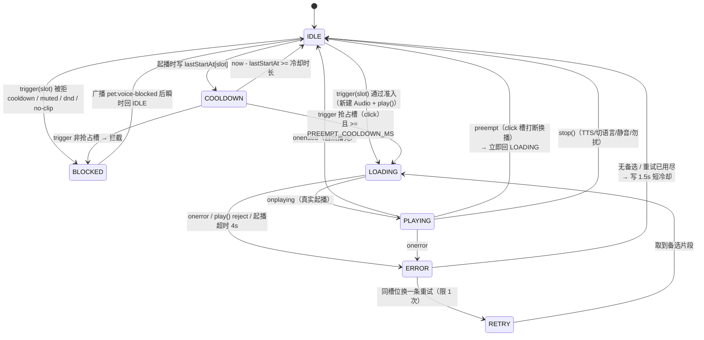
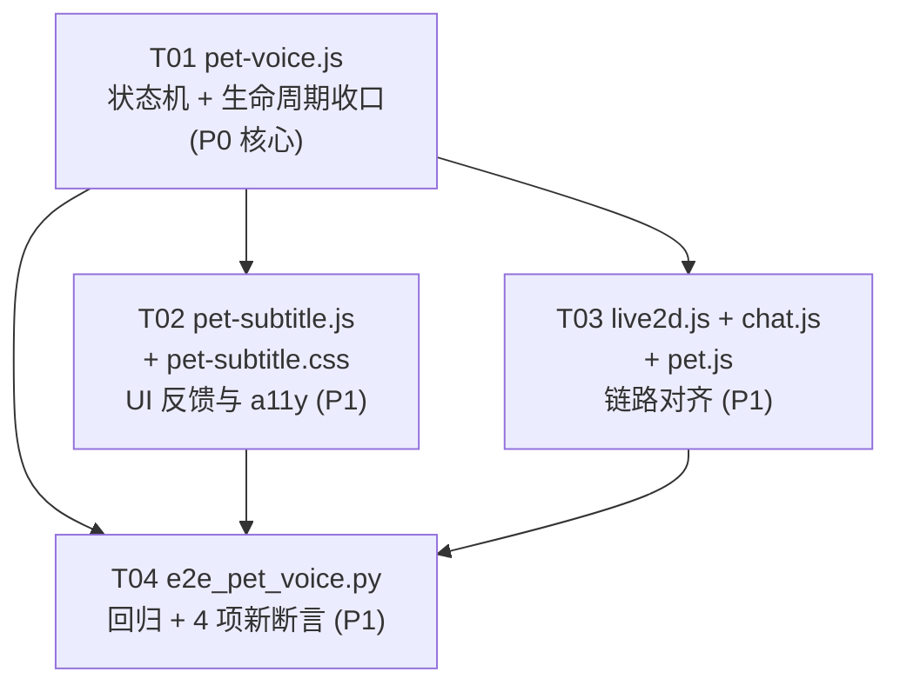

# 点击触发语音播放 —— 现状分析 · 根因复现 · 增量设计

> 作者：架构师 高见远　|　状态：**只做分析设计，未改动任何项目源文件**（复现脚本在 `C:/tmp/rp_voice_repro/`）
> 复现环境：静态服务器 `127.0.0.1:18080` + Playwright/Chromium(1217) 真实鼠标点击，Windows 11
> 项目根：`C:/Users/Lenovo/WorkBuddy/2026-07-27-16-45-03/roleplay-ai`

---

## 一、复现与根因报告

### 1.1 复现方法

| 项 | 内容 |
|---|---|
| 服务器 | `python -m http.server 18080 --bind 127.0.0.1`，根目录 `frontend/`（已测完关闭） |
| 浏览器 | `chromium-1217/chrome-win64/chrome.exe`，headless，`--autoplay-policy=no-user-gesture-required --use-gl=swiftshader` |
| 点击方式 | `page.mouse.click()` 真实鼠标事件，非 `dispatchEvent`（宠物页引导层遮挡处已单独标注） |
| 埋点 | hook `Audio.prototype.play` + 监听 `pet:voice-line/playing/ended/stopped` + `pet:intent:click` + `live2d:interact`，全部带毫秒时间戳 |
| 脚本 | `C:/tmp/rp_voice_repro/repro.py`、`repro2.py`、`repro3.py`；原始事件流 `e2_long.json`、`e4_pet_layer.json` 等 |
| 干扰排除 | 静音=false、勿扰=false、语言=zh、位置锁定=false，全程无 pageerror |

### 1.2 实测数据

#### 实验 A —— 聊天页（index.html / Live2D）每 3 秒真实点击，共 20 次 / 60 秒

| # | 时刻 | 结果 | # | 时刻 | 结果 |
|---|---|---|---|---|---|
| 1 | 0.03s | ✅ zh_07 | 11 | 30.21s | ❌ 静默 |
| 2 | 3.06s | ✅ zh_08 | 12 | 33.23s | ❌ 静默 |
| 3 | 6.07s | ✅ zh_21 | 13 | 36.26s | ❌ 静默 |
| 4 | 9.10s | ✅ zh_16 | 14 | 39.29s | ❌ 静默 |
| 5 | 12.12s | ✅ zh_21 | 15 | 42.31s | ❌ 静默 |
| 6 | 15.13s | ✅ zh_41（1.84s） | 16 | 45.33s | ✅ zh_21 |
| 7 | 18.15s | ❌ 静默 | 17 | 48.35s | ✅ zh_08 |
| 8 | 21.16s | ❌ 静默 | 18 | 51.37s | ✅ zh_41 |
| 9 | 24.18s | ❌ 静默 | 19 | 54.38s | ❌ 静默 |
| 10 | 27.20s | ❌ 静默 | 20 | 57.40s | ❌ 静默 |

关键时间线：
```
t=15.13s  play zh_41（dur=1.84s，click 槽最短的一条）
t=17.34s  ended → lastPlayedAt['click'] = 17.34 → 冷却至 42.34s
t=18.15s ~ 42.31s   9 次点击连续静默，跨度 24.2 秒
t=45.33s  恢复发声（17.34 + 25 = 42.34 ✅ 精确吻合）
t=51.37s  play zh_41 → t=53.57s ended → 冷却至 78.57s
t=54.38s / 57.40s   再次静默
```

**60 秒出声率 9/20 = 45%；最长连续静默 24.2 秒（9 次点击）。**

#### 实验 B —— 桌面宠物页（pet.html / Spine）每 3 秒真实点击，共 22 次 / 66 秒

| # | 时刻 | 结果 | # | 时刻 | 结果 |
|---|---|---|---|---|---|
| 1 | 0.01s | ✅ zh_21 | 12 | 33.30s | ❌ 静默 |
| 2 | 3.03s | ✅ zh_07 | 13 | 36.31s | ❌ 静默 |
| 3 | 6.05s | ✅ zh_16 | 14 | 39.34s | ❌ 静默 |
| 4 | 9.08s | ✅ zh_07 | 15 | 42.36s | ✅ zh_41（1.84s） |
| 5 | 12.10s | ✅ zh_16 | 16 | 45.38s | ❌ 静默 |
| 6 | 15.13s | ✅ zh_41 | 17 | 48.40s | ❌ 静默 |
| 7 | 18.16s | ❌ 静默 | 18 | 51.43s | ❌ 静默 |
| 8 | 21.20s | ❌ 静默 | 19 | 54.46s | ❌ 静默 |
| 9 | 24.21s | ❌ 静默 | 20 | 57.48s | ❌ 静默 |
| 10 | 27.25s | ❌ 静默 | 21 | 60.51s | ❌ 静默 |
| 11 | 30.27s | ❌ 静默 | 22 | 63.55s | ❌ 静默 |

**66 秒出声率 7/22 = 32%；最长连续静默 21.2 秒（8 次点击）。**
（注：宠物页首次实验因 `#pet-onboarding.open` 新手引导层遮挡画布，14 次点击 0 发声。该遮挡是 headless 无 localStorage 的测试环境产物，非产品缺陷；关闭引导后链路正常，上表为关闭后的数据。）

#### 实验 C —— 冷却窗口精确测量（API 层，1 秒轮询探测）

```
首次 playForSlot('click') → zh_07（dur=3.02s）
音频 ended 于 t=3.58s
探测 +5s  / +10s / +15s / +20s → 全部被拦截
探测 +25s (t=28.90s) → 成功播放 zh_16
>>> 音频结束后 25.3s 才允许再次发声
```

#### 实验 D —— 打断窗口的偶然性（happy 槽最长片段 zh_05，dur=12.22s）

| 探测时刻 | 结果 |
|---|---|
| +500ms | ❌ 拦截（`currentTime` 0.5 < 2） |
| +1500ms | ❌ 拦截（`currentTime` 1.5 < 2） |
| +3000ms | ✅ 打断换播 zh_07 |
| +4500ms | ❌ 拦截（新片段只播了 1.5s） |
| +6000ms | ✅ 打断换播 zh_41 |

**同一段音频期间，点击能不能出声完全取决于"手气"，用户无法形成任何预期。**

#### 实验 E —— 异常路径

| 场景 | 实测结果 |
|---|---|
| mp3 全部 404 | 互斥**已释放** ✅，但 6/6 次都能**立刻重播**（冷却被 `play().catch` 里的 `delete lastPlayedAt[slot]` 删掉了）→ **加载成功要等 25s，加载失败反而秒重播，语义倒置** |
| mp3 请求永久挂起（弱网 stalled） | ❌ **互斥残留**：4 秒后探测新槽位 `playForSlot('surprise')` 返回 `null`，且此后所有非 force 调用永远返回 `null`，**必须刷新页面才能恢复** |
| 播放中被 `tts:started` 打断（走 `stop()`） | ⚠️ **冷却被完全跳过**，可立即重播（与"播完要等 25s"形成反差） |
| 单条槽位连续 force（`enter` 槽 zh 只有 1 条） | `['zh_00', null, null]` —— 该片段播放期间该槽位恒为 no-op |
| 静默期间的可见反馈 | 角色动作照做、气泡照弹、TTS 请求照发（后端 501 失败），但**无原声、无字幕、无任何"冷却中"提示** |

### 1.3 根因排序

| 排序 | 根因 | 位置 | 证据类型 | 说明 |
|---|---|---|---|---|
| **主因 1** | **同槽位冷却 25s，且从 `ended` 起算** | `pet-voice.js:35` `SLOT_COOLDOWN_MS`；`:135`/`:143` 写入 `lastPlayedAt[slot]`；`:193` 判定 | **实测确认** | 实验 A/B/C 三方交叉验证。冷却起点在 `onended`/`onerror` 闭包内，导致"台词越短，死寂越长"：1.84s 的 zh_41 → 26.8s 死寂；6.18s 的 zh_08 → 31.2s 死寂 |
| **主因 2** | **冷却期零反馈** | 无对应代码（缺失） | **实测确认** | 实验 E：静默期 `live2d:interact` 每次照常广播，角色动、气泡弹，但不发声不出字幕。用户判定为"坏了"而非"在冷却" |
| **次因 3** | **打断窗口 `currentTime > 2` 造成双峰体验** | `pet-voice.js:184` | **实测确认** | 实验 D：同一段音频期间 +1.5s 被吞、+3s 成功、+4.5s 又被吞。实验 A 前 6 次连点全出声（走打断），第 7~15 次全静默（走冷却），体验完全不可预测 |
| **次因 4** | **异常路径导致 `audio` 引用残留 → 全局永久假死** | `pet-voice.js:181` `if (audio && !audio.ended) return null;` | **实测确认（挂起场景）** | 实验 E：请求挂起时 `play()` Promise 不 settle、`onerror` 不触发 → `audio` 永不为 null → 所有槽位（非 force）永久返回 null。**这是比冷却更严重的故障：不刷新页面无法恢复** |
| **次因 5** | **冷却语义不一致（3 处）** | `:143` onerror 写 25s / `:156` catch 无条件 delete / `:103-109` `stop()` 不写冷却 | **实测确认** | 实验 E：404 秒重播（6/6）、打断无冷却、播完等 25s。三条路径三种行为 |
| **次因 6** | **单条槽位被 `currentClipId` 去重卡死** | `pet-voice.js:98` `c.id !== currentClipId` | **实测确认** | 实验 E：`enter` 槽 zh 仅 1 条，播放期间该槽位恒 no-op |
| **次因 7** | `play().catch` 里的 `delete lastPlayedAt[slot]` 无 `audio === a` guard | `pet-voice.js:156` | **静态分析推断** | 旧音频的迟到 rejection 会误删新音频所在槽位的冷却。当前被次因 5 的其他表现掩盖，未单独复现 |
| **次因 8** | `justPlayed()` 以"调用过 playClip"为准而非"真的在播" | `pet-voice.js:118` / `chat.js:865` | **静态分析推断 + 日志佐证** | 服务器日志显示静默期仍在发 `POST /voice/tts`（501 失败）。若原声被自动播放策略拦截，`lastVoiceLineAt` 仍被写入 → chat.js 跳过 TTS → **原声没响、TTS 也不响 = 完全无声** |

### 1.4 两条链路的频率限制叠加（实测校准）

| 层级 | 聊天页 index.html | 桌面宠物页 pet.html |
|---|---|---|
| ① 点击判定 | `live2d.js:760` 800ms 防连击 | `pet.js:585` 位移 <5px 判点击，**无时间节流** |
| ② 区域冷却 | `_playRegion` body 3000ms / lower 3500ms —— **不影响语音**（语音触发已上移至 `live2d.js:767`） | 无 |
| ③ 语音层互斥 | `pet-voice.js:181` 全局互斥，仅 click 槽 `currentTime>2` 可打断 | 同左（共用 pet-voice.js） |
| ④ 语音层冷却 | `pet-voice.js:193` 25s（从 ended 起算） | 同左 |
| **合成后实际体验间隔** | **双峰：要么 ≤2s（打断成功），要么 25s + 台词时长（26.8~31.2s）** | 同左 |

> 结论：两条链路的**瓶颈完全在语音层的第 ③④ 级**，①②级不是瓶颈（实验 A/B 中 3s 间隔点击均未被 800ms 防连击拦截）。修 ①② 无用，必须改 ③④。

---

## 二、交互状态机设计

### 2.1 状态图



> `COOLDOWN` 是一个**平行于 IDLE 的标记位**（每个 slot 独立），不是互斥态：`phase` 只反映音频生命周期（idle/loading/playing/error），冷却是否阻塞由 `canPlay()` 判定。这样设计是为了让"冷却中但可抢占"和"冷却中不可抢占"两种语义都能表达。

### 2.2 重复点击策略：**分层组合**（不是三选一）

| 槽位类型 | 槽位 | 策略 | 理由 |
|---|---|---|---|
| **用户主动** | `click` | **打断换播（抢占）**，受 `PREEMPT_COOLDOWN_MS=2000` 与 `MIN_INTERRUPT_MS=1200` 双重约束 | 用户主动点击是最强的"我要听"信号。宁可换句也不能沉默；但要有最小间隔防止狂点把音频切成噪音 |
| **叙事长台词** | `enter`、`battle` | **冷却内无视**，且**不可被抢占** | 开场白 / 战斗台词被切一半体验极差。`battle` zh 最长 62.6s，被切更糟 |
| **被动情绪/待机** | `idle`、`happy`、`sad`、`surprise`、`sleep`、`intel` | **冷却内无视**（冷却更长，12s） | 待机自动触发，不应打断用户正在听的原声；也不应被自己的高频待机刷屏 |

**为什么不做播放队列**：素材是随机台词、非顺序对话，排队播放会让"点击 → 响应"延迟到几十秒后，反而加重"点了没反应"的观感。队列深度 1 也只是把 25s 静默换成延迟播放，收益低、复杂度高。**最小变更原则下不做。**

### 2.3 参数设计

| 常量 | 现值 | 建议值 | 理由 | 待确认 |
|---|---|---|---|---|
| `SLOT_COOLDOWN_MS` | 25000（从 ended 起算） | **8000（从起播起算）** | 用户感知的节奏是"两次开口的间隔"，不是"播完到下次"。8s ≈ click 槽台词均长(4.3s)的 1.9 倍，死寂窗口从 26.8s 降到 ~3.7s | ⏳ PM 调研确认 |
| 冷却起算点 | `ended` | **起播时刻** | 修正"台词越短惩罚越重"的反直觉语义（主因 1） | — |
| `SLOT_COOLDOWN_OVERRIDE` | 无 | `{idle: 12000, battle: 60000, enter: 60000}` | 被动/长叙事槽更保守，防止待机刷屏 | ⏳ |
| `PREEMPT_SLOTS` | 硬编码 `slot === 'click'` | `['click']` | 抽出为常量，便于扩展 | — |
| `PREEMPT_COOLDOWN_MS` | 无 | **2000** | 抢占槽自身的最小间隔，防狂点刷屏。取 2000 是为了给 E2E-P 断言（2500ms）留 500ms 余量 | ⏳ |
| `MIN_INTERRUPT_MS` | 2000（隐含在 `audio.currentTime > 2`） | **1200** | 实测 1.5s 的点击被吞（实验 D）。1.2s 足够滤掉手滑双击，又不至于让用户觉得"卡了一下"。同时用**起播后经过时间**而非 `currentTime` 判定（后者在加载慢时为 0，语义不准） | ⏳ |
| `LOAD_TIMEOUT_MS` | 无 | **4000** | 起播看门狗：4s 未收到 `playing` 即判 stalled，强制收口。根治实验 E 的永久假死 | — |
| `WATCHDOG_EXTRA_MS` | 无 | **8000** | 播放中看门狗：`clip.dur*1000 + 8000` 未 `ended` 即强制收口。兜住 `ended` 不触发的极端场景 | — |
| `ERR_COOLDOWN_MS` | 无（现为"写 25s 又被 delete 删掉"的竞态） | **1500** | 失败后只写 1.5s 短冷却，让下一次点击能快速重试。修正语义倒置 | — |
| `ERR_RETRY` | 无 | **1** | 起播失败时换同槽位另一条重试一次，避免"点了没声" | — |
| Live2D 防连击 | 800ms | **350ms** | 800ms 对"连点换台词"偏保守；350ms 已足够滤掉误触双击 | ⏳ PM 调研确认 |
| 区域冷却 | body 3000 / lower 3500 | **保持不变** | 与语音已解耦（`live2d.js:767`），不是瓶颈 | — |

> ⏳ = 候选值，待产品经理调研结论校准。全部抽为模块顶部常量，**改一个数字即可**。

### 2.4 准入判定逻辑（`canPlay`）

```
canPlay(slot, opts):
  1. manifest 未加载            → {ok:false, reason:'not-ready'}
  2. body.dnd                   → {ok:false, reason:'dnd'}
  3. muted                      → {ok:false, reason:'muted'}
  4. opts.force                 → {ok:true}                       # 跳过 5~7
  5. audio 存在（loading/playing）:
       是抢占槽 && 已过 MIN_INTERRUPT_MS → {ok:true, mode:'preempt'}
       否则                              → {ok:false, reason:'busy', retryInMs}
  6. 该槽位冷却未过:
       是抢占槽 && 已过 PREEMPT_COOLDOWN_MS → {ok:true, mode:'preempt'}
       否则                                → {ok:false, reason:'cooldown', retryInMs}
  7. pickFromSlot 为空           → {ok:false, reason:'no-clip'}
  8.                            → {ok:true, mode:'normal'}
```

`retryInMs` 直接供 UI 层显示"还需等待 N 秒"或驱动冷却进度。

---

## 三、任务列表（工程师按序执行）

共 4 个任务，T01 为核心，T02/T03 可并行，T04 最后。

### T01 — `pet-voice.js` 状态机与生命周期收口（P0，核心）

**目标文件**：`frontend/js/pet-voice.js`（改动集中在 92~197 行 + 新增状态区 + 新增 API）

**改动点**：
1. 顶部新增常量块：`SLOT_COOLDOWN_MS=8000`、`SLOT_COOLDOWN_OVERRIDE`、`PREEMPT_SLOTS`、`PREEMPT_COOLDOWN_MS=2000`、`MIN_INTERRUPT_MS=1200`、`LOAD_TIMEOUT_MS=4000`、`WATCHDOG_EXTRA_MS=8000`、`ERR_COOLDOWN_MS=1500`、`ERR_RETRY=1`
2. 新增模块状态：`phase`（'idle'|'loading'|'playing'|'error'）、`curSlot`、`curClip`、`startedAt`、`loadTimer`、`watchTimer`、`retryUsed`
3. `lastPlayedAt` 语义改为 `lastStartAt`（**起播时刻**），删除 `play().catch` 中无 guard 的 `delete lastPlayedAt[slot]`（`:156`）
4. 新增 `_setPhase(p, reason)`：状态转移唯一入口，内部广播 `pet:voice-state`
5. 新增 `_finish(reason)` —— **所有退出路径的唯一收口**：清 loadTimer/watchTimer → `audio.pause(); audio.src=''; audio=null` → 按 reason 写冷却 → `_setPhase('idle')` → 广播 `pet:voice-ended`/`pet:voice-stopped`。`onended` / `onerror` / `play().catch` / 起播超时 / 看门狗 / `stop()` 六条路径**必须全部调用它**
6. `playClip` 内挂载 `LOAD_TIMEOUT_MS` 起播看门狗与 `dur+WATCHDOG_EXTRA_MS` 播放看门狗
7. `onerror` / `play().catch` 走 `_finish('error')` → 若 `retryUsed < ERR_RETRY` 且同槽位有备选片段则重试一次，否则写 `ERR_COOLDOWN_MS` 短冷却
8. `pickFromSlot`：pool 为空时**回退为不去重**（允许重复当前 clip），修复单条槽位恒 no-op
9. 新增对外 API：`getState()`、`canPlay(slot, opts)`；保留 `justPlayed()`（内部改为基于 phase，见 T03 说明）
10. 新增事件 `pet:voice-state`、`pet:voice-blocked`

**验收标准**：
- [ ] 六条退出路径全部经 `_finish()`，代码审查时 grep `audio = null` 只应出现在 `_finish` 内
- [ ] 起播时刻写入 `lastStartAt[slot]`，`onended` 不再写冷却
- [ ] 起播超时 4s / 看门狗超时能强制收口（用 `page.route` 挂起请求验证：挂起 5s 后 `playForSlot('surprise')` 应能返回非 null）
- [ ] 404 时：重试 1 次换片段 → 仍失败则写 1.5s 短冷却，1.5s 后同槽位可重播，且**不再出现"秒重播"与"等 25s"并存**
- [ ] `pickFromSlot('enter')` 在 zh 单条槽位下不再返回 null
- [ ] 现有 E2E 17 项断言**全部仍通过**（尤其 D、K、N、P，见 §四.4）

### T02 — `pet-subtitle.js` + `pet-subtitle.css`：加载/拦截/播放态反馈（P1）

**目标文件**：`frontend/js/pet-subtitle.js`、`frontend/css/pet-subtitle.css`

**改动点**：
1. 订阅 `pet:voice-state`：`phase='loading'` → **立即显示字幕**（不必等 `playing`）+ `.is-loading` 类 + `aria-busy="true"`；`phase='playing'` → 移除 `.is-loading`；`phase='idle'` → 隐藏（保留 `HIDE_EXTRA_MS` 停留）
2. 订阅 `pet:voice-blocked`：`reason='cooldown'` → 闪现上一句字幕 700ms（`.is-replay` 类，60% 透明度，无位移）；`reason='busy'|'protect'|'muted'|'dnd'` → **不闪**（避免视觉噪音）
3. `#pet-lang-badge`：`phase='playing'` → `.is-playing` 呼吸光圈；补 `tabindex="0"` + `aria-pressed` + Enter/Space 键盘支持（现状只能鼠标点，a11y 缺陷）
4. CSS 新增：`#pet-subtitle.is-loading`、`#pet-subtitle.is-replay`、`#pet-lang-badge.is-playing` 三套样式 + `@media (prefers-reduced-motion: reduce)` 关闭动画

**验收标准**：
- [ ] 点击后字幕在 300ms 内出现（不等音频起播），消除"点击 → 字幕延迟"的脱节
- [ ] 冷却期点击时字幕以 60% 透明度闪现上一句 700ms
- [ ] 徽章可 Tab 聚焦、Enter/Space 切换语言、有 `aria-pressed`
- [ ] E2E-G/H/K/L/O/O2 断言仍通过

### T03 — `live2d.js` + `chat.js` + `pet.js`：链路对齐与 TTS 兜底修正（P1）

**目标文件**：`frontend/js/live2d.js`、`frontend/js/chat.js`、`frontend/js/pet.js`

**改动点**：
1. `live2d.js`：抽出 `CLICK_THROTTLE_MS = 350` 常量替换 `:760` 的硬编码 800
2. `live2d.js:_handleClick`：在 `emitIntent("click")` 之后读 `window.RoleplayPetVoice.getState()`；若 `phase==='idle'` 且本次未发声，可广播一个轻量 `live2d:voice-silent`（可选，见 §六.4）
3. `chat.js:863-865`：**把 `justPlayed(600)` 改为基于状态机**
   ```js
   const st = (pv && pv.getState) ? pv.getState() : null;
   const voiceTook = !!(st && (st.phase === 'playing' || st.phase === 'loading'));
   ```
   修复"原声失败但 TTS 被跳过 → 完全无声"（次因 8）
4. `pet.js:653`（`spawnFeedback`）：发声时主题色涟漪；拦截时灰白小涟漪。需从 `pet:voice-blocked` 事件取状态（pet.js 已有 `spawnFeedback(x, y)`，加一个 `muted` 参数即可）
5. `pet-voice.js:justPlayed()` 保留但内部改为：`return phase === 'playing' || phase === 'loading'`（向后兼容 chat.js 旧调用）

**验收标准**：
- [ ] 静默期点击时，若原声未起播则 TTS 正常兜底发声（用 `page.route` 让 mp3 404，验证 TTS 被触发）
- [ ] 350ms 内的连续点击只触发一次；400ms 后能触发
- [ ] 宠物页拦截态涟漪为灰白
- [ ] E2E-N（tts:started 自停）仍通过

### T04 — `tests/e2e_pet_voice.py`：回归 + 新增断言（P1）

**目标文件**：`tests/e2e_pet_voice.py`

**改动点**：保留现有 A~P 全部 17 项，新增 4 项：
- **Q. 冷却时长**：播一条 click → 记录起播时刻 → 每 1s 探测 → 断言首次成功时刻落在 `[起播+8s, 起播+9.5s]` 区间内（**取代"25s"的隐式契约**）
- **R. 弱网不自锁**：`page.route` 挂起 mp3 → 等 5s（`LOAD_TIMEOUT_MS` + 1s）→ 断言 `playForSlot('surprise')` 返回非 null（验证看门狗收口）
- **S. 失败可重试**：mp3 全部 404 → 断言 1.5s 后同槽位能重播；且断言 404 后**不产生** 8s 长冷却
- **T. 冷却期有反馈**：触发一次 → 等落进冷却 → 再点击 → 断言字幕条获得 `.is-replay` 类（或 `pet:voice-blocked` 事件 `reason==='cooldown'`）

**验收标准**：
- [ ] 21 项断言全绿
- [ ] 在 18080 服务器上跑通（脚本内注明需先起服务器）

### 任务依赖图



---

## 四、文件清单与接口设计

### 4.1 涉及文件与职责

| 文件 | 职责 | 改动规模 |
|---|---|---|
| `frontend/js/pet-voice.js` | 语音播放核心：manifest 加载、槽位抽取、**状态机**、冷却、语言、静音、事件广播 | 大（~150 行重写 92~197 行区域） |
| `frontend/js/pet-subtitle.js` | 双语字幕 + 语言徽章，改为订阅状态机 | 中（~50 行） |
| `frontend/css/pet-subtitle.css` | 新增 loading / replay / playing 三套状态样式 | 小（~30 行） |
| `frontend/js/live2d.js` | 聊天页点击链路，节流常量化 | 小（~5 行） |
| `frontend/js/chat.js` | `live2d:interact` 的 TTS 兜底判定改为基于状态机 | 小（~5 行） |
| `frontend/js/pet.js` | 点击涟漪区分发声/拦截态 | 小（~8 行） |
| `tests/e2e_pet_voice.py` | 回归 + 新增 4 项断言 | 中（~70 行） |

> 依赖方向不变：`pet-voice.js` 仍只依赖 `shared/pet-core.js`，`pet-subtitle.js` 仍只依赖 `pet-voice.js` 的事件，无新增耦合。

### 4.2 新增/修改的函数签名

```js
// ── pet-voice.js 新增对外 API ──────────────────────────────

/**
 * 查询语音模块当前状态。UI 层据此渲染加载/播放/冷却反馈。
 * @returns {{
 *   phase: 'idle'|'loading'|'playing'|'error',
 *   slot: string|null,
 *   clipId: string|null,
 *   startedAt: number|null,          // 本条起播时间戳（ms）；phase 非 playing/loading 时为 null
 *   elapsedMs: number,               // phase 为 playing/loading 时，距起播已过毫秒
 *   cooldownRemainingMs: number,     // 当前 slot 还需冷却多久；0 = 立即可播
 *   canPreempt: boolean,             // 当前 slot 是否允许打断换播
 *   muted: boolean, lang: 'zh'|'en', dnd: boolean
 * }}
 */
function getState()

/**
 * 判定一次触发能否发声（不产生副作用，纯查询）。
 * UI 层可在真正触发前调用，决定是否给出"冷却中"提示。
 * @param {string} slot   语义槽位名
 * @param {{force?: boolean}} [opts]  force=true 跳过冷却/互斥（E2E 与内部复用）
 * @returns {{ok: boolean, mode?: 'normal'|'preempt',
 *            reason?: 'not-ready'|'dnd'|'muted'|'busy'|'cooldown'|'no-clip',
 *            retryInMs?: number}}   retryInMs 为预计解除阻塞的毫秒数
 */
function canPlay(slot, opts)

// ── pet-voice.js 内部新增（不暴露）──────────────────────────

/** 状态转移唯一入口：更新 phase 并广播 pet:voice-state。 */
function _setPhase(phase, reason)

/**
 * 生命周期唯一收口。onended / onerror / play().catch / 起播超时 /
 * 看门狗超时 / stop() 六条路径都必须调用。
 * 保证：返回后 audio === null、所有 timer 已清、冷却已按 reason 写入。
 * @param {'ended'|'error'|'stop'|'timeout'|'watchdog'} reason
 * @param {Object|null} clip  触发收口的片段（用于事件 detail）
 * @param {string|null} slot
 */
function _finish(reason, clip, slot)

// ── pet-voice.js 修改签名（语义变更，签名不变）───────────────

/** justPlayed 语义变更：由"最近调用过 playClip"改为"当前真的在播/在加载"。 */
function justPlayed(withinMs)   // 参数保留但忽略，内部用 phase 判定

// ── pet-subtitle.js 内部新增 ────────────────────────────────

/** 以 replay（复用上一句）模式短暂闪现字幕。 */
function flashReplay(ms)
```

### 4.3 事件契约

#### 保持不变（向后兼容，语义与 detail 结构完全一致）

| 事件 | detail | 触发时机 |
|---|---|---|
| `pet:voice-line` | `{clip, slot, lang, subtitle:{zh,en}}` | 起播前（选中片段即发） |
| `pet:voice-playing` | `{clip, slot}` | 真实起播（`onplaying`） |
| `pet:voice-ended` | `{clip, slot}` | 自然播完 |
| `pet:voice-stopped` | `{clip, slot, reason}` | 出错 / 切语言 / 手动 stop |
| `pet:voice-lang` | `{lang}` | 语言切换 |

#### 新增

| 事件 | detail | 触发时机 |
|---|---|---|
| `pet:voice-state` | `{phase, slot, clipId, startedAt, cooldownRemainingMs, canPreempt, reason}` | **每次状态转移**（`_setPhase` 内统一广播） |
| `pet:voice-blocked` | `{slot, reason:'cooldown'\|'busy'\|'no-clip'\|'muted'\|'dnd'\|'not-ready', retryInMs}` | 一次触发被拒绝时（**不**为 `force` 调用广播） |

> `pet:voice-blocked` 是修复"静默期零反馈"的关键：让 UI 层有机会告诉用户"她刚说过啦"。

### 4.4 向后兼容核对（现有 17 项 E2E 断言逐条验证）

| 断言 | 依赖点 | 改后是否通过 | 说明 |
|---|---|---|---|
| A 模块加载 | `ready()` | ✅ | 不变 |
| B 槽位播放 | `playForSlot('click')` | ✅ | 新页无冷却，正常起播 |
| C 事件广播 | `pet:voice-line` | ✅ | 不变 |
| **D 冷却不打断** | 起播后 300ms 再触发 click，不应新增 `play()` | ✅ | 300ms < `MIN_INTERRUPT_MS=1200` → 判 `busy` 拦截。**注意：必须用"起播后经过时间"判定，不能用 `audio.currentTime`**（加载慢时 currentTime 为 0，会误放行） |
| E 静音 | `setMuted(true)` | ✅ | 不变 |
| F 无错误 | console/pageerror | ✅ | 需保证 `_finish` 不抛异常 |
| G 双语字幕 | `playForSlot('idle', {force:true})` | ✅ | 改后 loading 即显示字幕，更早更稳 |
| H 英配切换 | `setLang('en')` | ✅ | 不变 |
| I 切回中配 | `toggleLang()` | ✅ | 不变 |
| J manifest schema | fetch manifest | ✅ | 不变 |
| **K 字幕随音频结束消失** | 播最短 clip，等 `dur+2.5s` 后隐藏 | ✅ | `HIDE_EXTRA_MS=1600`，最短 clip 1.84s → 3.44s < 4.34s。若改为 loading 即显示，隐藏时点仍由 `ended` 驱动，**不要**改成由 `canPlay` 驱动 |
| L 切语言字幕隐藏 | `setLang` 广播 `stopped` | ✅ | `_finish('stop')` 仍广播 `pet:voice-stopped` |
| M 勿扰拦截 | `body.dnd` | ✅ | 不变 |
| **N tts:started 自停** | hook `Audio.prototype.pause` 计数增加 | ✅ | **关键**：`_finish` 内必须调用 `audio.pause()`，即便 `onended` 路径也要调（自然播完时 pause 是 no-op 但计数仍 +1） |
| O 字幕宽度 | 320×480 视口 | ✅ | 新增的 `.is-loading`/`.is-replay` 样式不得改变盒模型宽度 |
| O2 常驻徽章 | `#pet-lang-badge` 可见可点 | ✅ | 补 `tabindex` 不影响可见性；`.is-playing` 只加 box-shadow |
| **P click 打断** | 播 enter 2.5s 后触发 click 换句 | ✅ | 2500ms > `MIN_INTERRUPT_MS=1200`；且 click 槽从未播放 → `lastStartAt['click']` 为 0，`PREEMPT_COOLDOWN_MS=2000` 检查通过。另需保证 `pickFromSlot('click')` 非空：5 条 zh clip 去掉 `currentClipId`（enter 的 zh_00）仍有 5 条 |

**结论：17 项断言在建议参数下全部保持通过。** 唯一需要工程师警惕的是 D / N / P 三项，上面已逐条标注陷阱。

---

## 五、联动动作设计

### 5.1 徽章 / 字幕的状态呈现

| 状态 | 字幕条 `#pet-subtitle` | 语言徽章 `#pet-lang-badge` | 宠物页涟漪 |
|---|---|---|---|
| **加载中**（loading） | 立即显示双语文本 + `.is-loading`（75% 透明度，左侧金线呼吸动画）+ `aria-busy="true"` | — | 主题紫涟漪（点击时立即给，不等音频） |
| **播放中**（playing） | 移除 `.is-loading`，全不透明显示 | `.is-playing` 呼吸光圈（`box-shadow` 2s 循环） | — |
| **冷却中**（cooldown，被 click 拦截） | 闪现上一句字幕 700ms + `.is-replay`（60% 透明度，无位移动画） | 保持常态 | 灰白小涟漪（半径 60%） |
| **播放中被抢占/打断** | 直接切新字幕（走正常 line → loading → playing） | — | 主题紫涟漪 |
| **错误/无备选** | `.is-loading` 移除并隐藏；若 1.5s 内重试成功则无缝衔接新字幕 | — | 灰白涟漪 |
| **静音 / 勿扰** | 不显示 | 徽章 `opacity:.45` + `title="已静音"` | 灰白涟漪 |

### 5.2 无障碍属性

```html
<!-- 字幕条（已有 role/aria-live，新增 aria-busy） -->
<div id="pet-subtitle" role="status" aria-live="polite" aria-busy="false">…</div>

<!-- 语言徽章（补 tabindex / aria-pressed / 键盘支持） -->
<div id="pet-lang-badge" role="button" tabindex="0"
     aria-pressed="false"          <!-- false=中配, true=英配 -->
     aria-label="切换配音，当前中配" title="切换配音（中配 / 英配）">…</div>
```

- 键盘：`Enter` / `Space` 触发 `toggleLang()`；`e.stopPropagation()` 保持现状（不触发宠物点击）
- `pet:voice-blocked` **不做 `aria-live` 播报** —— 会在屏幕阅读器里刷屏，只做视觉反馈
- 所有动画包在 `@media (prefers-reduced-motion: reduce)` 内降级为无动画

### 5.3 动画反馈与播放结束回调的统一收口

**统一收口**（T01 改动点 5）是本次结构性修复的核心：

```js
// 六条路径 → 一个函数
a.onended          → _finish('ended', clip, slot)
a.onerror          → _finish('error', clip, slot)
play().catch()     → _finish('error', clip, slot)
loadTimer (4s)     → _finish('timeout', clip, slot)
watchTimer (dur+8) → _finish('watchdog', clip, slot)
stop()             → _finish('stop', curClip, curSlot)
```

`_finish` 内部固定顺序：①清 `loadTimer`/`watchTimer` → ②`audio.pause(); audio.src=''; audio=null` → ③按 reason 写冷却 → ④`_setPhase('idle')` 广播 `pet:voice-state` → ⑤广播 `pet:voice-ended` 或 `pet:voice-stopped`。

**结构性保证**：`audio = null` 在整个模块内只允许出现在 `_finish` 一处。任何"某个异常路径忘了清引用"的 bug 从此不可能发生 —— 这是根治次因 4（永久假死）的关键，比逐条补 `onerror` 更可靠。

### 5.4 字幕与语音状态的一致性保证

现状的字幕同步依赖 4 个事件的拼装 + `curClipId` 过滤（防"旧片段 error 晚到误隐新字幕"）。改后：

1. **单一事实来源**：字幕组件以 `pet:voice-state.phase` 为主驱动 —— `loading`/`playing` 显示，`idle`/`error` 隐藏（带 `HIDE_EXTRA_MS` 停留）
2. **`phrase` 与 `clipId` 双重校验**：`pet:voice-state` 携带 `clipId`，字幕组件保留现有 `curClipId` 过滤作为二次保险（不删除，零风险）
3. **字幕提前显示**：`loading` 阶段就显示字幕（不等 `onplaying`），消除实测中"点击 → 字幕延迟出现"的脱节感；若 4s 起播超时则走 `_finish('timeout')` → 字幕自动隐藏
4. **拦截态复用**：`pet:voice-blocked(reason='cooldown')` 时复用 `curClipId` 对应的上一句字幕闪现，不需额外存储

---

## 六、待明确事项（需用户 / 产品确认）

| # | 问题 | 我的倾向 | 影响面 |
|---|---|---|---|
| 1 | **冷却时长取多少？** 8s（我）/ 6s / 10s / 保留 25s | **8s，从起播起算**。25s 是实测的主要痛点；再短会失去"防刷屏"意义 | `SLOT_COOLDOWN_MS` 一个常量 |
| 2 | **冷却是否按槽位差异化？** 被动槽（idle/happy）要不要比 click 更长 | **要**：`idle` 12s、`battle`/`enter` 60s。否则待机自动语音会刷屏 | `SLOT_COOLDOWN_OVERRIDE` 一个 map |
| 3 | **是否允许"打断换播"？** | **click 允许，enter/battle 不允许**。叙事长台词被切一半体验极差 | `PREEMPT_SLOTS` 一个数组 |
| 4 | **冷却中的点击给什么反馈？** ① 完全静默（现状）② 重复上一句字幕 ③ 角色摆手小动作 + 气泡 | **②**（成本最低、语义最准："她刚说过啦"）。③ 需要新动画资源，学生项目性价比低 | T02 工作量；③ 会显著增加 |
| 5 | **是否要播放队列？** | **不要**。随机台词排队会让"点击 → 响应"延迟到几十秒后，反而加重"点了没反应" | 若要做，T01 需重构为队列调度器，工作量翻倍 |
| 6 | **起播超时 4s 是否可接受？** 弱网下可能误杀慢加载 | **4s**。素材是本地/局域网 mp3，4s 已很宽松；超时后 1.5s 短冷却可快速重试 | `LOAD_TIMEOUT_MS` 一个常量 |
| 7 | **`enter` 槽 zh 只有 1 条**，是否补料？ | 本次靠"pool 为空则允许重复"兜底（T01 改动点 8）。**建议后续补 2~3 条中配 enter 台词**，否则开场永远同一句 | 需重新跑听录切片流水线 |
| 8 | **静默期点击要不要走 TTS 兜底？** 现状 TTS 请求会发出但后端 501 失败 | **要**（T03 改动点 3）。原声没响时必须有 TTS 兜底，否则是完全无声 | chat.js 5 行 |

---

## 附录：复现产物清单

| 路径 | 内容 |
|---|---|
| `C:/tmp/rp_voice_repro/repro.py` | 第一轮：E1 宠物页点击 / E2 聊天页点击 / E3 冷却测量 / E4 异常路径（404·挂起·打断·槽位耗尽） |
| `C:/tmp/rp_voice_repro/repro2.py` | 第二轮：P1 宠物页链路探测 / P2 聊天页 60s / P3 长音频互斥 / P4 宠物页语音层 60s |
| `C:/tmp/rp_voice_repro/repro3.py` | 第三轮：宠物页真实点击 66s / 404 冷却竞态 ×6 / 静默期反馈检测 |
| `C:/tmp/rp_voice_repro/e2_long.json` | 聊天页 60s 完整事件流（带毫秒时间戳） |
| `C:/tmp/rp_voice_repro/e4_pet_layer.json` | 宠物页语音层 60s 事件流 |
| `C:/tmp/rp_voice_repro/e5_pet_real.json` | 宠物页真实点击 66s 事件流 |

> 服务器已关闭（18080 端口已释放），项目源文件**零改动**。
